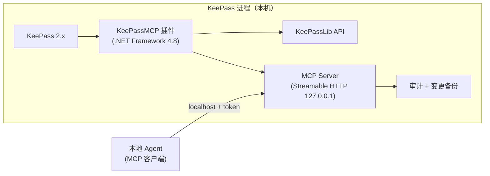

# KeePassMCP

**KeePass 原生 MCP 插件**：对本机暴露 MCP 服务（Streamable HTTP），本地 Agent 连接后**可见/可操作除掩码字段外的所有字段**——重新分类、重新命名、整理元数据，密码等受保护字段在协议层、实现层、数据层三层不可达。

> 状态：**设计定稿（含密钥访问边界）、P0 验证全部通过，进入 P1**。设计见 [docs/DESIGN.md](docs/DESIGN.md)；**实施请读 [docs/HANDOFF.md](docs/HANDOFF.md)**（自包含规格：工具/资源/掩码/安全/验收标准）；词表与决策见 [CONTEXT.md](CONTEXT.md) / [docs/adr/](docs/adr/)。

## 一句话定位

KeePass 进程内嵌 MCP 门卫：按 KDBX `Protect` 标志自动掩码，Agent 默认只能读写元数据（标题/URL/备注/自定义字段/分组/标签）；创建条目时可写入密钥，读取/修改已有密钥需审批（白名单/弹窗），明文永不进入常规读出口。

## 核心设计

- **掩码边界**：`Protect="True"` 字段 → 不可见（输出 `[protected]`）、不可操作（工具 schema 不含、实现层拒绝）
- **传输**：Streamable HTTP，仅绑定 `127.0.0.1` 回环 + Bearer token 鉴权
- **写保护**：所有写工具支持 `dry_run=true` 变更预览（与执行共用同一变更计算函数）；破坏性操作需 `confirm=true`；变更前自动备份 + 审计日志
- **密钥边界**：创建新条目可写入密钥（免审批）；读取/修改已有密钥需审批（白名单免审批 + KeePass 弹窗，超时拒绝）；读出口/审计/备份永不含明文
- **锁库联动**：KeePass 锁定即拒绝一切读写

## 架构



## MCP 工具（设计）

- 只读：`list_databases` / `list_groups` / `list_entries` / `get_entry` / `search_entries` / `get_audit_log`
- 写（元数据）：`rename_entry` / `update_entry_fields` / `move_entry` / `create_group` / `rename_group` / `delete_group` / `add_tag` / `remove_tag` / `create_entry` / `backup_database`
- 资源：`keepass://groups`、`keepass://entries/{uuid}`、`keepass://audit` 等

## 目录

```
keepass-mcp/
├── CONTEXT.md          # 领域词表（保护字段/掩码/密钥访问审批等）
├── docs/DESIGN.md      # 设计方案（决策记录）
├── docs/HANDOFF.md     # ★实施交接文档（编码会话直接读这份）
├── docs/adr/           # ADR-0001 密钥边界模型 / ADR-0002 审批机制
├── src/                # 插件工程 + P0 验证探针（KeePassMCP.sln）
└── README.md
```

## 决策记录

- 2026-10-01 掩码：仅按 `Protect` 标志，UserName 不加入默认掩码（可见可操作），配置可追加
- 2026-10-01 dry-run：写操作需预览，预览与执行共用同一变更计算函数
- 2026-10-01 连接：标准 MCP 客户端配置（`type: http` + Bearer token）
- 2026-10-01 密钥边界（访谈定稿）：创建可写密钥、读改需审批、明文永不外泄（ADR-0001/0002）
- 2026-10-01 客户端/自主权/落盘：通用标准客户端；写自主白名单 + 全局确认开关；默认手动保存

## 下一步

P0 已通过（2026-10-01）：SDK 2.2.0 net48 ✓、HttpListener 非管理员绑定 ✓、插件加载便携版 2.60.0 ✓、掩码 API ✓。按 [docs/HANDOFF.md](docs/HANDOFF.md) §13 推进：**P1 只读**（MCP 服务 + token + 锁定态 + list/get/search + 掩码序列化器）→ P2 写操作 → P3 密钥访问与打磨。
