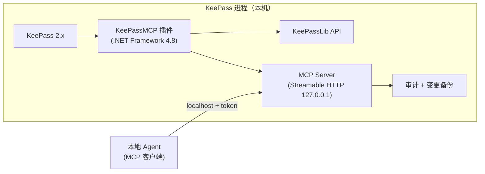

# KeePassMCP

**KeePass 原生 MCP 插件**：对本机暴露 MCP 服务（Streamable HTTP），本地 Agent 连接后**可见/可操作除掩码字段外的所有字段**——重新分类、重新命名、整理元数据，密码等受保护字段在协议层、实现层、数据层三层不可达。

> 状态：**P0–P8 完成（2026-10-03）**——只读/写/审计/备份、库内配置字段体系（`_mcp_*`）、token 双字段双向同步、保存数据库、MCP Server Config 可视化配置页（条目表单注入 tab）、配置条目专属图标/颜色（保存时全量应用）。逻辑探针 238/238；真实库端到端验证全绿。设计见 [docs/DESIGN.md](docs/DESIGN.md)；**实施请读 [docs/HANDOFF.md](docs/HANDOFF.md)**（自包含规格：工具/资源/掩码/安全/验收标准）；词表与决策见 [CONTEXT.md](CONTEXT.md) / [docs/adr/](docs/adr/)。

## 一句话定位

KeePass 进程内嵌 MCP 门卫：按 KDBX `Protect` 标志自动掩码，Agent 默认只能读写元数据（标题/URL/备注/自定义字段/分组/标签）；创建条目时可写入密钥，读取/修改已有密钥由**条目字段授权**（`_mcp_read` / `_mcp_write` 等，配置条目聚合），明文永不进入常规读出口。

## 核心设计

- **掩码边界**：`Protect="True"` 字段 → 不可见（输出 `[protected]`）、不可操作（工具 schema 不含、实现层拒绝）
- **传输**：Streamable HTTP，仅绑定 `127.0.0.1` 回环 + Bearer token 鉴权（token 由配置页重新生成，双字段同步到库内）
- **写保护**：所有写工具支持 `dry_run=true` 变更预览（与执行共用同一变更计算函数）；破坏性操作需 `confirm=true`；变更前自动备份 + 审计日志
- **密钥边界**：创建新条目可写入密钥（免审批）；读/改已有密钥按条目 `_mcp_*` 字段授权（读受保护字段需 `_mcp_read_protected`，改需 `_mcp_write_protected` 等）；读出口/审计/备份永不含明文
- **配置**：库内配置条目（`_mcp_config=1`，标题任意、可多条目并集）承载监听/鉴权/默认权限；无配置条目时自动创建 `MCPServerConfiguration`
- **锁库联动**：KeePass 锁定即拒绝一切读写

## 架构



## MCP 工具（设计）

- 只读：`list_databases` / `list_groups` / `list_entries` / `get_entry` / `search_entries` / `get_audit_log`（后两项需 `_mcp_audit_default=1`）
- 写（元数据）：`rename_entry` / `update_entry_fields` / `move_entry` / `create_group` / `rename_group` / `delete_group` / `add_tag` / `remove_tag` / `create_entry` / `restore_backup`（需 `_mcp_backup_default=1`）/ `save_database`（需 `_mcp_save_default=1`，默认拒绝）
- 密钥：`read_secret`（需 `_mcp_read_protected` 授权；明文仅此工具可出）
- 资源：`keepass://groups`、`keepass://entries/{uuid}`、`keepass://audit` 等

## 安装

**环境要求**：Windows + KeePass 2.x（本机验证版本 2.60.0）+ .NET Framework 4.8（系统自带）。

1. **获取插件**：源码构建（`dotnet build src\KeePassMCP.sln`）或使用发布包（未来打成的 `.plgx` 单文件，见 docs/HANDOFF.md §9.10）。
2. **部署**（目录形态）：
   - 在 KeePass 的 `Plugins\` 下建子目录 `KeePassMCP\`；
   - 把 `KeePassMCP.dll` **和依赖** `Newtonsoft.Json.dll` 一起放入该子目录（依赖必须与插件同目录，缺依赖会弹"未能加载文件或程序集"）；
   - 重启 KeePass。
   - 若为 `.plgx` 单文件：直接放入 `Plugins\` 根目录即可（内含依赖）。
3. **验证已加载**：
   - 菜单 **工具 → KeePassMCP 配置...** 出现 → 插件已加载；
   - 或查看 `%APPDATA%\KeePassMCP\keepassmcp.log` 出现 `KeePassMCP initialized`；
   - 或确认 `%APPDATA%\KeePassMCP\connection.json` 已生成（内含本机端口与 token）。

> 注意：升级/替换 DLL 前**必须先关闭 KeePass**——运行中的 KeePass 会锁住插件 DLL，复制可能"看起来成功"实际未生效。

## 配置

配置分两层：**库内配置条目**（主，P6-3/P7）与 `%APPDATA%\KeePassMCP\config.json`（辅，仅附加掩码字段）。

### 库内配置条目（推荐，可视化）

- 任意条目加字符串字段 `_mcp_config=1` 即成为**配置条目**（标题不限，多条目取并集；普通条目标题为 `MCPServerConfiguration` 时可一键识别——保存时自动套用专属图标/浅绿背景）。
- 打开配置条目 → **MCP Server Config** tab（P7 注入的可视化页）：服务开关、监听地址（`;` 分隔多地址，端口占用自动 +1）、鉴权 token（可重新生成，双字段同步到 Password 输入框）、九项默认权限三态、作用域开关。
- 核心字段（也可在 Advanced → String Fields 手写）：
  - `_mcp_server=1` 启用监听 / `_mcp_server=0` 停止；`_mcp_listening=127.0.0.1:6789;0.0.0.0:8080`
  - `_mcp_token`（与 `Password` 双向同步）——token 并集，任一匹配放行；**并集为空 → 无鉴权（仅回环建议）**
  - 默认权限：`_mcp_read_default` / `_mcp_read_protected_default` / `_mcp_write_default` / `_mcp_write_protected_default` / `_mcp_move_default` / `_mcp_list_default` / `_mcp_audit_default` / `_mcp_backup_default` / `_mcp_save_default`（0/1；跨配置条目布尔**最严聚合**——任一 0 拒）
  - `_mcp_scope_self=1`：本条目不并入全局并集/聚合
- 普通条目的权限字段：`_mcp_read` / `_mcp_read_protected` / `_mcp_write` / `_mcp_write_protected` / `_mcp_move` / `_mcp_list`（`_mcp_list=0` → 对 MCP 客户端隐身）。优先级：条目显式字段 → 配置条目 default 最严聚合 → 内置硬编码。
- 无任何配置条目时，插件自动创建 `MCPServerConfiguration`（根组、回环 127.0.0.1:6789、随机 token、默认权限）；已有配置条目时**绝不覆盖/补字段**。
- `_mcp_` 前缀为保留字段：MCP 写入一律拒绝（`reserved_field`），读出口整条目掩码。

### config.json（辅）

`%APPDATA%\KeePassMCP\config.json`（可用环境变量 `KeePassMCP_DATA_DIR` 覆盖数据目录）：

| 键 | 类型 | 说明 |
|---|---|---|
| `extraMaskedFields` | string[] | 附加敏感字段名：这些字段在 `Protect` 标志之外再强制掩码 |

## 连接与快速验证

插件启动后自动生成 `%APPDATA%\KeePassMCP\connection.json`（每次启动写后自校验端口），内容形如：

```json
{
  "port": 53029,
  "url": "http://127.0.0.1:53029/mcp",
  "mcp_client": {
    "type": "http",
    "url": "http://127.0.0.1:53029/mcp",
    "headers": { "Authorization": "Bearer <token>" }
  }
}
```

标准 MCP 客户端（moirai 等）按 `mcp_client` 段配置即可（Streamable HTTP + Bearer token，仅 127.0.0.1 回环）。

> token 管理：`connection.json` 的 token 即库内配置条目的鉴权 token（每次启动同步）。在 KeePass 里打开配置条目 → MCP Server Config tab →「重新生成」可轮换（双字段同步，旧 token 即刻失效）。

### agent 端接入示例（如何声明这个 MCP server）

**hermes-agent / moirai**（`~/.hermes/config.yaml`，改后执行 `/reload-mcp` 重载）：

```yaml
mcp_servers:
  keepassmcp:
    url: "http://127.0.0.1:53029/mcp"
    headers:
      Authorization: "Bearer ${env:KEEPASSMCP_TOKEN}"   # token 从 connection.json 的 Authorization 取，建议放 ~/.hermes/.env 而非明文
    # 可选：只暴露只读工具（服务端另有审批/掩码，这里是客户端侧过滤）
    # tools:
    #   include: [list_databases, list_groups, list_entries, get_entry, search_entries, get_audit_log]
    #   exclude: [delete_group, restore_backup]          # 黑名单例：破坏性工具
    # 可选：hermes 层写审批（与插件弹窗审批叠加）
    # trust: untrusted
```

- 连接后工具以 `mcp__keepassmcp__<tool>` 命名（如 `mcp__keepassmcp__read_secret`，hermes 沿 Claude Code/Codex 约定）。
- 传输默认即 Streamable HTTP，无需额外 `transport` 字段；token 从 `%APPDATA%\KeePassMCP\connection.json` 的 `mcp_client.headers.Authorization` 复制。

**Claude Code / 其他 type-http 客户端**（`.mcp.json` 或 `claude_desktop_config.json`）：

```json
{
  "mcpServers": {
    "keepassmcp": {
      "type": "http",
      "url": "http://127.0.0.1:53029/mcp",
      "headers": { "Authorization": "Bearer <token>" }
    }
  }
}
```

**通用要点**：KeePassMCP 是 Streamable HTTP（非 stdio、非 SSE），任何支持 MCP HTTP transport 的客户端都能连；端口每次启动可能变化，token 每次启动持久不变（在库内配置条目，`connection.json` 同步最新值），建议客户端用 `connection.json` 里的最新值或脚本动态注入。

> **参考客户端实现**：`tools/e2e_http_check.py` 已完整实现握手、信封解析、掩码断言——新客户端接入以此为准，比从零写可靠。

## Client contract（客户端接入契约）

- **无会话（stateless）**：本服务不维护 MCP 会话——`initialize` 握手后**无需** `notifications/initialized`、无需回传 `Mcp-Session-Id` 头，直接 POST + `Authorization: Bearer` 即可（2025-06-18 协议允许 stateless 实现）。重复握手无害但多余。
- **信封语义**（JSON-RPC 响应 `result.content[0].text` 内嵌 JSON，`ok` / `error`）：

| 现象 | 含义 |
|---|---|
| HTTP 200 + `result` + `content[0].text` 内 `ok=true` | 工具成功 |
| HTTP 200 + `result` + `isError=true`，text 内 `ok=false` + `error.code` | 工具业务失败（权限/未找到/锁定等） |
| HTTP 401 / 403 | token 无效 / Host 不在白名单（鉴权层） |
| HTTP 405 / 413 / 其他 | 协议层失败（方法不支持/请求过大） |

- **响应头声明 UTF-8**：所有响应 `Content-Type: application/json; charset=utf-8`，客户端按 UTF-8 解码（勿按 Latin-1）。
- **list_entries**：缺省 `group_uuid` 返回根组直接条目；`recursive=true` 全库平铺（含全部子组条目，每条带 `group_path` 供聚合）。
- **uuid/计数**：所有 uuid 服务端统一大写 hex 输出，**查找大小写不敏感**；`list_groups` 的 `entry_count` 含全部子组条目（递归计数）。
- **响应语义**：`move_entry` 已在目标组 → `no_op`（error 形态，实为已满足）；`create_group` 真跑响应 `changes[0].target.uuid`=真实组 uuid（dry-run 为占位）。**无 `delete_entry`**——删单条/批量用 临时组 + move + delete_group 模式。
- **配置条目**：读出口整条目掩码（`title=[protected]`、`protected_field_names=["*"]`），同时携带非敏感标志 `is_config_entry=true`，客户端可编程跳过/标注。

命令行快速验证（PowerShell）：

```powershell
$c = Get-Content "$env:APPDATA\KeePassMCP\connection.json" -Raw
$port = [regex]::Match($c, '"port":\s*(\d+)').Groups[1].Value
$tok  = [regex]::Match($c, '"Authorization":\s*"Bearer\s+(\w+)"').Groups[1].Value

# 1) 协议握手
curl.exe -X POST "http://127.0.0.1:$port/mcp" -H "Authorization: Bearer $tok" `
  -H "Content-Type: application/json" `
  -d '{"jsonrpc":"2.0","id":1,"method":"initialize","params":{"protocolVersion":"2025-06-18","capabilities":{},"clientInfo":{"name":"test","version":"0"}}}'

# 2) 工具清单
curl.exe -X POST "http://127.0.0.1:$port/mcp" -H "Authorization: Bearer $tok" `
  -H "Content-Type: application/json" -d '{"jsonrpc":"2.0","id":2,"method":"tools/list","params":{}}'

# 3) 已打开库（需 KeePass 已开库并解锁）
curl.exe -X POST "http://127.0.0.1:$port/mcp" -H "Authorization: Bearer $tok" `
  -H "Content-Type: application/json" -d '{"jsonrpc":"2.0","id":3,"method":"tools/call","params":{"name":"list_databases","arguments":{}}}'
```

## 安全使用须知

- **掩码**：`Password` 恒输出 `[protected]`；库内 `Protect="True"` 字段与配置 `extraMaskedFields` 同样掩码；`UserName` 默认可见。任何读出口、审计、备份不含明文。
- **字段即授权**（ADR-0003）：普通条目的 `_mcp_read/_mcp_write/...` 字段显式授权；无字段 → 配置条目 default 最严聚合 → 内置默认（读写元数据允许、读/写受保护字段拒绝、audit/backup/save 拒绝）。受保护字段明文**永不出口**（无 read_secret 审批出口）。
- **dry-run**：所有写工具支持 `dry_run=true` 预览（零副作用：不落库/不备份/不审计）；含保护字段的预览一律掩码。
- **审计与备份**：写执行、密钥访问（只记字段名）全部记入 `audit.jsonl`；写前自动备份到 `backups\`；`restore_backup` 可回滚非保护字段（保护字段不触碰）。审计/备份权限默认拒绝，需配置条目 `_mcp_audit_default=1` / `_mcp_backup_default=1`。
- **锁定联动**：KeePass 锁定库后，该库一切请求返回 `database_locked`。
- **明文唯一路径**：创建条目时写入密钥（`fields` 直填或 `generate_password` 插件内生成）；已有密钥的明文在任何读出口不可达。

## 目录

```
keepass-mcp/
├── CONTEXT.md          # 领域词表（保护字段/掩码/密钥访问审批等）
├── docs/DESIGN.md      # 设计方案（决策记录）
├── docs/HANDOFF.md     # ★实施交接文档（编码会话直接读这份）
├── docs/adr/           # ADR-0001 密钥边界模型 / ADR-0002 审批机制 / ADR-0003 字段权限模型
├── docs/keepass-skill/ # 豆包客户端配套技能（SKILL.md + references/tools.md，连接/安全铁律/18 工具参考）
├── src/                # 插件工程 + P0/P1 探针（KeePassMCP.sln：KeePassMCP、P0Probe.*、P1Probe.Tools）
└── README.md
```

## 决策记录

- 2026-10-01 掩码：仅按 `Protect` 标志，UserName 不加入默认掩码（可见可操作），配置可追加
- 2026-10-01 dry-run：写操作需预览，预览与执行共用同一变更计算函数
- 2026-10-01 连接：标准 MCP 客户端配置（`type: http` + Bearer token）
- 2026-10-01 密钥边界（访谈定稿 Q1 三态）：创建可写密钥、读改需授权、明文永不外泄（ADR-0001/0002 → ADR-0003 字段权限模型）
- 2026-10-03 ADR-0003（用户拍板）：审批弹窗/白名单/secret_whitelist 全部废止 → 库内 `_mcp_*` 字段体系（字段即授权、布尔最严聚合、scope_self、token 并集）；token 绑定 Password 输入框双字段双向同步；配置条目自动创建与专属样式
- 2026-10-03 客户端/自主权/落盘：通用标准客户端；默认手动保存 + 显式 `save_database`（默认拒绝闸门 + 保存前快照）

## 下一步

**P0–P8 全部完成（2026-10-03）**：只读/写/审计/备份 → 库内配置字段体系 → token 双字段双向同步 → save_database → MCP Server Config 可视化配置页（条目表单注入）→ 配置条目专属样式（保存时全量应用）。逻辑探针 238/238；真实库验证全绿。可选后续：打成 `.plgx` 单文件发布包（见 docs/HANDOFF.md §9.10）；Agent 端示例配置接入文档已在本 README §连接。
