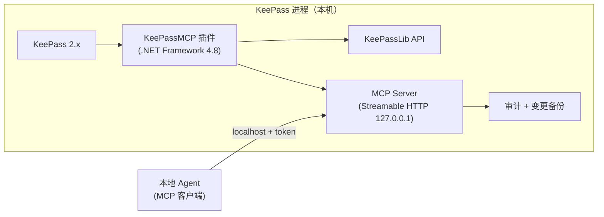

# KeePassMCP

**KeePass 原生 MCP 插件**：对本机暴露 MCP 服务（Streamable HTTP），本地 Agent 连接后**可见/可操作除掩码字段外的所有字段**——重新分类、重新命名、整理元数据，密码等受保护字段在协议层、实现层、数据层三层不可达。

> 状态：**P0–P5 完成（P5：dry-run 审批语义修复——预览不弹窗、保护字段掩码；逻辑探针 143/143；真实测试库集成验证全绿）**。设计见 [docs/DESIGN.md](docs/DESIGN.md)；**实施请读 [docs/HANDOFF.md](docs/HANDOFF.md)**（自包含规格：工具/资源/掩码/安全/验收标准）；词表与决策见 [CONTEXT.md](CONTEXT.md) / [docs/adr/](docs/adr/)。

## 一句话定位

KeePass 进程内嵌 MCP 门卫：按 KDBX `Protect` 标志自动掩码，Agent 默认只能读写元数据（标题/URL/备注/自定义字段/分组/标签）；创建条目时可写入密钥，读取/修改已有密钥需审批（白名单/弹窗），明文永不进入常规读出口。

## 核心设计

- **掩码边界**：`Protect="True"` 字段 → 不可见（输出 `[protected]`）、不可操作（工具 schema 不含、实现层拒绝）
- **传输**：Streamable HTTP，仅绑定 `127.0.0.1` 回环 + Bearer token 鉴权
- **写保护**：所有写工具支持 `dry_run=true` 变更预览（与执行共用同一变更计算函数）；破坏性操作需 `confirm=true`；变更前自动备份 + 审计日志
- **密钥边界**：创建新条目可写入密钥（免审批）；读取/修改已有密钥需审批（白名单免审批 + KeePass 弹窗，超时拒绝）；读出口/审计/备份永不含明文
- **锁库联动**：KeePass 锁定即拒绝一切读写

## 架构



## MCP 工具（设计）

- 只读：`list_databases` / `list_groups` / `list_entries` / `get_entry` / `search_entries` / `get_audit_log`
- 写（元数据）：`rename_entry` / `update_entry_fields` / `move_entry` / `create_group` / `rename_group` / `delete_group` / `add_tag` / `remove_tag` / `create_entry` / `backup_database`
- 资源：`keepass://groups`、`keepass://entries/{uuid}`、`keepass://audit` 等

## 安装

**环境要求**：Windows + KeePass 2.x（本机验证版本 2.60.0）+ .NET Framework 4.8（系统自带）。

1. **获取插件**：源码构建（`dotnet build src\KeePassMCP.sln`）或使用发布包（未来打成的 `.plgx` 单文件，见 docs/HANDOFF.md §9.10）。
2. **部署**（目录形态）：
   - 在 KeePass 的 `Plugins\` 下建子目录 `KeePassMCP\`；
   - 把 `KeePassMCP.dll` **和依赖** `Newtonsoft.Json.dll` 一起放入该子目录（依赖必须与插件同目录，缺依赖会弹"未能加载文件或程序集"）；
   - 重启 KeePass。
   - 若为 `.plgx` 单文件：直接放入 `Plugins\` 根目录即可（内含依赖）。
3. **验证已加载**：
   - 菜单 **工具 → KeePassMCP 配置...** 出现 → 插件已加载；
   - 或查看 `%APPDATA%\KeePassMCP\keepassmcp.log` 出现 `KeePassMCP initialized`；
   - 或确认 `%APPDATA%\KeePassMCP\connection.json` 已生成（内含本机端口与 token）。

> 注意：升级/替换 DLL 前**必须先关闭 KeePass**——运行中的 KeePass 会锁住插件 DLL，复制可能"看起来成功"实际未生效。

## 配置

配置文件 `%APPDATA%\KeePassMCP\config.json`（可用环境变量 `KeePassMCP_DATA_DIR` 覆盖数据目录），也可用菜单 **工具 → KeePassMCP 配置...** 可视化编辑：

| 键 | 类型 | 说明 |
|---|---|---|
| `secret_whitelist` | string[] | 密钥访问白名单：条目 UUID 数组；命中条目对 `read_secret` / 保护字段更新**免审批**，全程审计 |
| `extraMaskedFields` | string[] | 附加敏感字段名：这些字段在掩码第一层（Password 硬掩码）与第二层（IsProtected 标志）之外再强制掩码 |
| `confirm_writes` | bool | 全局"写需确认"开关：`true` 时所有写工具需传 `confirm:true` 才执行 |

- 条目 UUID 获取：调用 `get_entry` 响应中的 `uuid` 字段，或 `read_secret`/`update` 的审计记录。
- 白名单 UUID 格式：32 位十六进制（可含连字符，配置 UI 会自动归一化）。

## 连接与快速验证

插件启动后自动生成 `%APPDATA%\KeePassMCP\connection.json`（每次启动写后自校验端口），内容形如：

```json
{
  "port": 53029,
  "url": "http://127.0.0.1:53029/mcp",
  "mcp_client": {
    "type": "http",
    "url": "http://127.0.0.1:53029/mcp",
    "headers": { "Authorization": "Bearer <token>" }
  }
}
```

标准 MCP 客户端（moirai 等）按 `mcp_client` 段配置即可（Streamable HTTP + Bearer token，仅 127.0.0.1 回环）。

命令行快速验证（PowerShell）：

```powershell
$c = Get-Content "$env:APPDATA\KeePassMCP\connection.json" -Raw
$port = [regex]::Match($c, '"port":\s*(\d+)').Groups[1].Value
$tok  = [regex]::Match($c, '"Authorization":\s*"Bearer\s+(\w+)"').Groups[1].Value

# 1) 协议握手
curl.exe -X POST "http://127.0.0.1:$port/mcp" -H "Authorization: Bearer $tok" `
  -H "Content-Type: application/json" `
  -d '{"jsonrpc":"2.0","id":1,"method":"initialize","params":{"protocolVersion":"2025-06-18","capabilities":{},"clientInfo":{"name":"test","version":"0"}}}'

# 2) 工具清单
curl.exe -X POST "http://127.0.0.1:$port/mcp" -H "Authorization: Bearer $tok" `
  -H "Content-Type: application/json" -d '{"jsonrpc":"2.0","id":2,"method":"tools/list","params":{}}'

# 3) 已打开库（需 KeePass 已开库并解锁）
curl.exe -X POST "http://127.0.0.1:$port/mcp" -H "Authorization: Bearer $tok" `
  -H "Content-Type: application/json" -d '{"jsonrpc":"2.0","id":3,"method":"tools/call","params":{"name":"list_databases","arguments":{}}}'
```

## 安全使用须知

- **掩码**：`Password` 恒输出 `[protected]`；库内 `Protect="True"` 字段与配置 `extraMaskedFields` 同样掩码；`UserName` 默认可见。任何读出口、审计、备份不含明文。
- **审批**：`read_secret`（读取明文一次）/ `update_entry_fields`（含保护字段）——白名单条目免审批；否则 KeePass 弹窗（显示库名/条目标题/字段名），60s 超时自动拒绝，拒绝/超时返回 `approval_denied` / `approval_timeout` 且无明文。
- **dry-run**：所有写工具支持 `dry_run=true` 预览（零副作用：不落库/不备份/不审计）；含保护字段的预览一律掩码。
- **审计与备份**：写执行、密钥访问（只记字段名）、审批事件全部记入 `audit.jsonl`；写前自动备份到 `backups\`（仅非保护字段）；`restore_backup` 可回滚非保护字段（保护字段不触碰）。
- **锁定联动**：KeePass 锁定库后，该库一切请求返回 `database_locked`。
- **明文唯一出口**：审批通过的 `read_secret` 响应一次；如需将密钥写回 Agent，建议优先 `create_entry` 的 `generate_password`（插件内生成，明文不经 Agent 上下文）。

## 目录

```
keepass-mcp/
├── CONTEXT.md          # 领域词表（保护字段/掩码/密钥访问审批等）
├── docs/DESIGN.md      # 设计方案（决策记录）
├── docs/HANDOFF.md     # ★实施交接文档（编码会话直接读这份）
├── docs/adr/           # ADR-0001 密钥边界模型 / ADR-0002 审批机制
├── src/                # 插件工程 + P0/P1 探针（KeePassMCP.sln：KeePassMCP、P0Probe.*、P1Probe.Tools）
└── README.md
```

## 决策记录

- 2026-10-01 掩码：仅按 `Protect` 标志，UserName 不加入默认掩码（可见可操作），配置可追加
- 2026-10-01 dry-run：写操作需预览，预览与执行共用同一变更计算函数
- 2026-10-01 连接：标准 MCP 客户端配置（`type: http` + Bearer token）
- 2026-10-01 密钥边界（访谈定稿）：创建可写密钥、读改需审批、明文永不外泄（ADR-0001/0002）
- 2026-10-01 客户端/自主权/落盘：通用标准客户端；写自主白名单 + 全局确认开关；默认手动保存

## 下一步

**P0**（SDK/HttpListener/插件加载/掩码 API）、**P1 只读**、**P2 写操作**、**P3 密钥访问**（read_secret + 白名单 + KeePass UI 弹窗审批 60s 超时拒绝 + update 保护字段审批 + restore_backup + 并发；真实测试库集成验证全绿含用户点"允许"弹窗审批）、**P4 配置 UI**（菜单 工具→KeePassMCP 配置 + 弹窗倒计时 + 多库路由验证）与 **P5 收尾**（dry-run 审批语义修复：预览不弹窗、保护字段掩码；探针 143/143）均已完成（2026-10-02）。剩余人工确认项见 [docs/DESIGN.md](docs/DESIGN.md) §12（锁定态、UI 可见变化、配置窗口/弹窗目视）。
