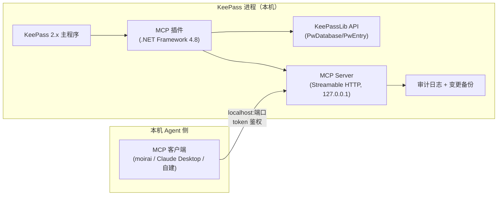

# KeePass MCP 插件设计方案（探索阶段）

> 状态：**探索/设计阶段，未实施**
> 日期：2026-10-01
> 定位：通用 KeePass 2.x 插件，对本机暴露 MCP 服务；本地 Agent（moirai 生态或其他 MCP 客户端）连接后**可见/可操作除掩码字段外的所有字段**（重新分类、重新命名、整理元数据等）
> 标记：〔设计〕= 设计决策（未验证）　〔待验证〕= 需实现前验证　〔参考〕= 参考生态先例

---

## 1. 目标与边界

**做什么**：让本地 AI Agent 通过 MCP 协议，对 KeePass 中已解锁的数据库执行**元数据整理**——重命名条目、改 URL/备注/自定义字段、条目跨分组移动（重新分类）、分组/标签管理、搜索与审计。

**明确不做**（安全边界）：
- 掩码字段（KDBX `Protect="True"` 的字段：密码、PIN、密钥等）**不可见、不可操作、不进入工具参数**
- 不导出数据库、不返回明文凭证、不做主密钥管理
- Agent 永远拿不到密码明文 → 即使 Agent 被诱导/被注入，也无法泄露凭证

---

## 2. 架构总览

〔设计〕要点：
- **传输用 Streamable HTTP**（Agent 无法把 GUI 应用当子进程 spawn，stdio 不可行）
- **只绑 127.0.0.1 回环** + token 鉴权（见 §6）
- 插件在 KeePass **解锁状态下**才开放读写；锁库即拒绝（见 §6.3）

---

## 3. 掩码规则（核心安全边界）

| 规则 | 实现 | 状态 |
|------|------|------|
| 字段级掩码 | KDBX 中字段的 **Protected 标志**（`<Value Protect="True">`）→ 掩码 | 〔设计〕 |
| 密码类字段 | `Password` 及用户标记保护的字段 → 永远掩码 | 〔设计〕 |
| 用户名字段 | 默认**不**掩码（**已确认 2026-10-01**：UserName 不加入默认掩码，可见可操作）；仍保留配置追加能力 | 〔设计〕✓已决 |
| 掩码呈现 | 读取时输出占位符 `[protected]` / `••••`，**绝不返回明文** | 〔设计〕 |
| 掩码不可写 | 写工具的参数 schema **不包含**保护字段；更新时对保护字段显式拒绝（即使传入也忽略/报错） | 〔设计〕 |
| 敏感字段清单 | 插件配置允许追加"额外掩码字段名"（如 UserName、自定义敏感项） | 〔设计〕 |

〔参考〕KeePassRPC 同样把"受保护字段不暴露给外部进程"作为第一原则；差异是本插件按 Protect 标志自动判定，而非硬编码字段名。

---

## 4. MCP 工具清单（Tools）

### 4.1 只读类

| 工具 | 说明 | 输出要点 |
|------|------|----------|
| `list_databases` | 列出已打开/解锁的数据库 | 名称、路径、锁定状态 |
| `list_groups` | 分组树（可按库过滤） | 树形结构、UUID |
| `list_entries` | 某分组/全库条目列表 | UUID、标题、组路径、掩码字段清单 |
| `get_entry` | 条目详情 | 全部**非掩码**字段值；掩码字段仅显示 `[protected]` |
| `search_entries` | 按标题/URL/备注/标签搜索 | 同 list_entries |
| `get_audit_log` | 查询插件审计日志 | 时间、操作、对象、结果 |

### 4.2 写类（仅元数据，掩码字段不可达）

| 工具 | 说明 | 安全约束 |
|------|------|----------|
| `rename_entry` | 改条目标题 | 标题非保护字段 |
| `update_entry_fields` | 改 URL/备注/自定义字段（非保护） | schema 排除保护字段；请求含保护字段名 → 拒绝 |
| `move_entry` | 条目跨分组移动（重新分类） | 目标分组须存在；默认保留回收站语义 |
| `create_group` / `rename_group` / `delete_group` | 分组管理 | delete_group 须 `confirm=true` 二次确认 |
| `add_tag` / `remove_tag` | 标签管理 | 仅元数据 |
| `create_entry` | 新建条目（不含密码） | 密码字段不在 schema 内 |
| `backup_database` | 触发变更前快照/手动备份 | 写操作前置自动备份（见 §6.4） |

〔设计〕写操作共性：**先备份后变更**（备份到插件数据目录或 KeePass 回收站语义），变更成功后写审计日志；`delete_group` 等破坏性操作要求显式 `confirm` 参数。
**dry-run 机制（已确认 2026-10-01）**：所有写工具支持 `dry_run=true` 参数（默认 false）。置真时**只计算并返回变更预览**（将重命名 N 个条目、将移动 X→Y 组、将删除组及其 M 个条目等），不落库；破坏性操作（delete_group 等）在 `dry_run=false` 时仍要求 `confirm=true` 二次确认。

---

## 5. MCP 资源清单（Resources）

按 MCP 规范，资源 = 只读数据 URI，供 Agent 直接读取（不进工具参数）：

| URI 模式 | 内容 |
|----------|------|
| `keepass://groups` | 全库分组树（JSON 结构） |
| `keepass://groups/{uuid}/entries` | 某分组下条目列表 |
| `keepass://entries/{uuid}` | 条目详情（同 get_entry 掩码规则） |
| `keepass://entries/{uuid}/fields` | 字段清单（含保护标志，不含明文） |
| `keepass://audit` | 最近审计日志 |

〔设计〕资源与工具共用同一掩码层，保证"能读的都能操作、能操作的都能读"。

---

## 6. 安全模型

### 6.1 传输与绑定
- 仅监听 `127.0.0.1:<端口>`（默认随机端口，插件启动时选定）
- 拒绝非回环来源（DNS 重绑定防护：校验 Host 头为 localhost/127.0.0.1）

### 6.2 鉴权
- 插件启动生成随机 token，写入 `%APPDATA%` 下**仅当前用户可读**的配置文件（如 `keepass-mcp/token.txt`，0600 权限）
- Agent 连接时在 Header 携带 `Authorization: Bearer <token>`
- 支持 `--token <path>` 或环境变量注入（给 moirai 等自建 Agent 用）

### 6.3 锁库联动
- 监听 KeePass 的锁/解锁事件（`FileLocked` / `FileOpened`）
- 锁定时 MCP 返回 `database_locked` 状态，**所有读写工具拒绝**
- 解锁后自动恢复

### 6.4 审计与回滚
- 每次写操作记录审计行：时间、工具、参数摘要、对象 UUID、结果
- 变更前自动备份：把涉及条目/分组的当前状态序列化为 JSON（**不含保护字段明文**，只备份结构+非掩码值），存插件数据目录
- 提供 `restore_backup <id>` 工具（仅插件管理员，需二次确认）

### 6.5 dry-run 预览层（已确认 2026-10-01）
- 写工具 `dry_run=true` 时返回结构化变更预览（对象、动作、旧值→新值、影响条目数），**不落库、不写备份**
- 预览结果与真实执行共用同一变更计算函数 → 预览所见即执行所得（防"预览一套、执行一套"）
- 建议 Agent 工作流：写操作先 `dry_run=true` → 人工/Agent 检查预览 → `dry_run=false` 执行

### 6.6 掩码不可写的强制层
- **协议层**：工具 schema 里不出现保护字段参数
- **实现层**：`update_entry_fields` 对请求中的保护字段名直接拒绝（防绕过）
- **数据层**：读出口统一走掩码序列化器，杜绝遗漏路径

---

## 7. 技术选型与兼容性

| 项 | 选型 | 说明 |
|----|------|------|
| 插件宿主 | KeePass 2.x 插件 API（`KeePass.Plugins.Plugin`） | 官方插件体系，可访问 KeePassLib |
| 运行时 | .NET Framework 4.8（KeePass 2.x 当前目标） | 兼容性前提 |
| MCP 实现 | 首选官方 C# SDK（ModelContextProtocol，netstandard2.0 兼容目标）；不可用则手写最小协议（initialize/tools/list/tools/call/resources/list/read + Streamable HTTP 传输） | 〔待验证〕SDK 在 .NET Framework 4.8 的可用性 |
| HTTP 宿主 | Kestrel（若 SDK 支持）或 HttpListener（.NET Framework 原生，最稳） | 〔待验证〕 |
| 数据访问 | KeePassLib（PwDatabase/PwGroup/PwEntry/ProtectedStringDictionary） | 插件内直接引用 |
| 掩码判定 | `PwEntry.Strings` 中 `ProtectedString.IsProtected` | 原生 API |
| Agent 连接形态（已确认） | **标准 MCP 客户端配置**：客户端配置文件声明 `type: http` + `url: http://127.0.0.1:<端口>` + `headers: {Authorization: Bearer <token>}`；token 由插件生成后供用户粘贴进配置 | 〔设计〕✓已决 |

---

## 8. 风险与待验证

1. **MCP C# SDK 在 .NET Framework 4.8 的可用性**（官方 SDK 面向现代 .NET，可能需 netstandard2.0 变体或自研最小实现）〔待验证〕
2. **插件与 KeePass 主程序线程模型**：MCP HTTP 服务在后台线程跑，操作 KeePassLib 需注意 UI 线程同步（KeePass 大量 API 假设在 UI 线程）〔待验证〕
3. **多库支持**：KeePass 支持多文档，工具需明确 `database_id` 参数〔设计〕
4. **KDBX 4.1 自定义数据/标签**：标签与公共自定义数据的读写 API 需核对〔待验证〕
5. **Agent 误操作防护**：批量移动/重命名仍可能造成用户不期望的变更 → 备份+审计+（可选）dry-run 预览参数〔设计〕
6. **与 KeePassRPC 端口冲突/生态并存**：默认端口随机可避免冲突〔设计〕

---

## 9. 与生态既有方案对比

| 方案 | 形态 | 协议 | 掩码 | 与本方案差异 |
|------|------|------|------|--------------|
| KeePassRPC | KeePass 插件 | JSON-RPC（浏览器扩展） | 保护字段不暴露 | 面向浏览器扩展，非 MCP |
| keepassxc-browser 协议 + MCP 适配 | KeePassXC 侧 | keepassxc-browser + MCP 适配层 | 依赖实现 | 需 KeePassXC 而非 KeePass，间接适配 |
| **本方案** | KeePass 原生插件 | **原生 MCP**（Streamable HTTP） | **Protect 标志自动掩码** | 原生集成、掩码规则自动、本机 Agent 直连 |

〔参考〕差异化价值：**KeePass 进程内原生 MCP + 按 Protect 标志的自动掩码**，避免 KeePassXC 引入和协议转换层。

---

## 10. 里程碑建议（若推进）

1. **P0 验证**：MCP SDK/自研协议在 .NET Framework 4.8 跑通最小 echo 服务；KeePass 插件加载 MCP 服务成功
2. **P1 只读**：list/search/get + 资源 URI + 掩码层
3. **P2 写操作**：重命名/改字段/移动/分组管理 + 备份审计 + 锁库联动
4. **P3 打磨**：多库、标签、配置 UI（KeePass 选项页）、dry-run、restore

---

## 11. 待用户决策

- [x] ~~掩码默认清单~~ **已决（2026-10-01）**：仅按 Protect 标志；UserName 不加入默认掩码（可见可操作），配置仍可追加
- [x] ~~写操作 dry-run~~ **已决（2026-10-01）**：需要 dry-run 预览（§4.2 / §6.5），预览与执行共用同一变更计算函数
- [x] ~~Agent 连接方式~~ **已决（2026-10-01）**：标准 MCP 客户端配置（§7 表格末行），token 由插件生成供用户配置

## 12. 下一步（P0 验证）

设计方案三项决策已齐，可进入最小验证（不阻塞，仍属探索阶段）：
1. 验证 MCP C# SDK 在 .NET Framework 4.8 的加载（或确认需手写最小协议）
2. KeePass 插件骨架加载 MCP 服务（HttpListener echo）成功
3. 掩码判定 API（`ProtectedString.IsProtected`）在 KeePassLib 中实测
