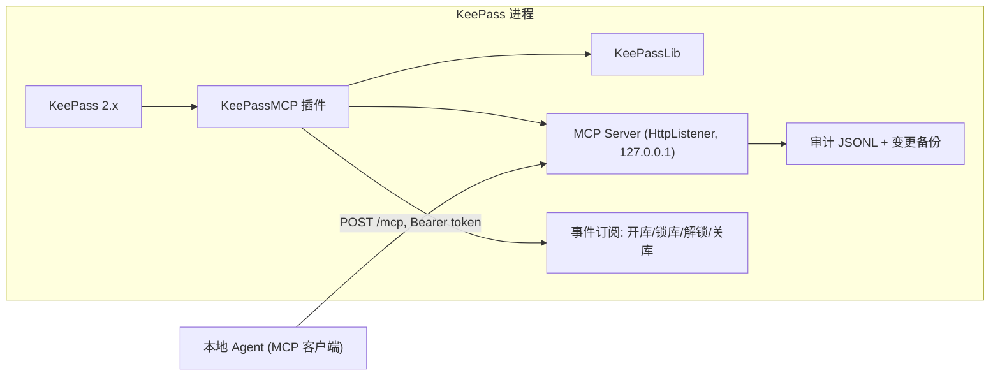

# KeePassMCP — 实施交接文档（Implementation Handoff）

> 面向：**负责写代码的会话**（无本对话上下文，本文档自包含，读此即可开工）
> 作者：设计会话（MainAgent），2026-10-01
> 配套文档：`docs/DESIGN.md`（设计背景与决策）、`README.md`（项目主页）
> 约定：本文档中的〔决策〕= 已定设计决策，必须遵守；〔待验证〕= 需在 P0 验证后定夺；〔建议〕= 推荐做法可调整

---

## 0. 任务一句话

开发一个 **KeePass 2.x 原生插件**，在本机（localhost）暴露一个 **MCP 服务**（Streamable HTTP 传输），使本地 AI Agent（标准 MCP 客户端）能**读取和修改数据库中除掩码字段外的所有字段**——重命名、重新分类（移动分组）、编辑 URL/备注/自定义字段、分组与标签管理、搜索、审计。**密码等受保护字段对 Agent 不可见、不可操作。**

**绝不实现**：除审批通过的 `read_secret` 单次返回外，返回任何受保护字段明文；修改主密钥；导出数据库；任何绕过掩码的路径。

**密钥边界（2026-10-01 访谈定稿，ADR-0001/0002）**：创建新条目时可写入保护字段值（`create_entry` 的 `fields` 或 `generate_password`，免审批）；读取已有保护字段明文（`read_secret`）与修改已有保护字段需**密钥访问审批**（白名单免审批 + KeePass UI 弹窗，超时拒绝，§6.6）；任何读出口/资源/审计/备份永不含保护字段明文。

---

## 1. 技术栈与硬约束

| 项 | 约束 | 说明 |
|----|------|------|
| 宿主 | KeePass 2.x（本机验证目标 2.60.0 便携版：`C:\Programs\KeePass\2.60.0\windows\amd64`；代码保持 2.5x+ 兼容） | 插件 API：`KeePass.Plugins.Plugin` 基类；引用便携版目录下 KeePassLib.dll 编译 |
| 运行时 | **.NET Framework 4.8**（KeePass 2.x 当前目标） | 非现代 .NET |
| UI | WinForms（复用 KeePass 主窗口） | 插件不新建主窗体 |
| 数据访问 | **引用 KeePass.exe（2.60 起 KeePassLib 合并进 KeePass.exe，无独立 KeePassLib.dll，P0 已核实）** | PwDatabase/PwGroup/PwEntry/ProtectedStringDictionary |
| MCP 实现 | **官方 C# SDK（ModelContextProtocol 2.2.0，netstandard2.0 目标）〔P0-a 已验证 2026-10-01〕**；传输接线：`StreamServerTransport` + HttpListener 适配（SDK 为 DI 风格 builder） | 若接线不顺可回退 §6.2 手写最小协议（协议已规格化） |
| HTTP 宿主 | **HttpListener**（.NET Framework 原生）〔建议〕 | 若 MCP SDK 自带 Kestrel 且能在 4.8 跑通，可用；否则 HttpListener 最稳 |
| 目标 | 单机插件（非跨平台优先） | Windows 为本项目目标平台 |

---

## 2. 架构



线程模型〔决策〕：
- HttpListener 请求处理在**后台线程**；**所有 KeePassLib 读写在 UI 线程执行**（`host.MainWindow` 的 `Invoke`/`BeginInvoke`，或用 `SynchronizationContext`）。KeePassLib 大量 API 非线程安全，这是本插件最关键的实现点。
- 每个 MCP 请求：后台线程接收 → 校验 token/锁定态 → marshal 到 UI 线程执行 → 结果回后台线程序列化返回。

---

## 3. 掩码规则（核心安全边界，〔决策〕）

**判定依据**：KDBX 字段的 **Protected 标志**（KeePassLib 中 `PwEntry.Strings` 为 `ProtectedStringDictionary`，每项 `ProtectedString.IsProtected`）。

强制规则（按优先级）：
1. 字段名 == `Password` → **永远掩码**（即使未标 Protect，防御性双保险）
2. 字段 `IsProtected == true` → 掩码
3. 配置的"附加敏感字段清单"（默认空，可配置如 `UserName`）→ 掩码
4. 其余字段（Title/UserName/URL/Notes/自定义非保护字段/Tags）→ 可见可操作

**掩码语义**：
- 读：掩码字段**绝不返回明文**，输出占位符 `[protected]`；同时返回 `protected_field_names` 数组告知 Agent 哪些被掩码
- 写：掩码字段**不可写**——工具 schema 不含；`update_entry_fields` 请求中若出现掩码字段名 → 整个请求拒绝，返回 `{ok:false, error:"field 'Password' is protected"}`

**统一出口**：所有读工具/资源经同一个 `MaskedEntrySerializer` 序列化，杜绝遗漏路径（§8 EntryDto）。

**审批例外（2026-10-01，ADR-0001/0002）**：
- `create_entry` 可携带保护字段值（`fields` 传值或 `generate_password` 插件内生成），免审批；生成路径明文不经 Agent 上下文
- `read_secret`：读取保护字段明文，白名单条目免审批、非白名单走弹窗审批；返回明文仅此一次，审计逐字段记录
- `update_entry_fields`：请求含保护字段名时，未审批 → 整体拒绝 `{ok:false, error:{code:"approval_required"}}`；审批通过 → 允许
- 任何读出口/审计/备份不得包含明文（不变量）

---

## 4. MCP 工具规格（Tools）

所有工具返回信封：`{ok: bool, data?: ..., error?: {code, message}}`；MCP 层 `content` 为 JSON 文本（`type:"text"`）。

写工具统一带 `dry_run` 参数〔决策〕：`dry_run=true` 只计算并返回变更预览，**不落库、不写备份、不写审计**；预览与执行共用同一变更计算函数（所见即所得）。

### 4.1 只读工具

**`list_databases`**
```
输入: {}
输出: data: [{id: string, name: string, path: string, locked: bool, group_count: int, entry_count: int}]
```

**`list_groups`**
```
输入: {database_id: string, parent_uuid?: string}   // 缺省返回全树
输出: data: [{uuid, name, parent_uuid, child_groups: [...递归], entry_count}]
```

**`list_entries`**
```
输入: {database_id: string, group_uuid?: string, limit?: int}
输出: data: [{uuid, title, username, group_path: string, tags: string[], protected_field_names: string[]}]
```

**`get_entry`**
```
输入: {database_id: string, entry_uuid: string}
输出: data: EntryDto（§8；掩码字段值恒为 "[protected]"）
```

**`read_secret`**（密钥访问，需审批）
```
输入: {database_id: string, entry_uuid: string, fields?: string[]}   // fields 缺省=全部保护字段
审批: 白名单条目免审批；非白名单 → KeePass UI 弹窗，60s 超时拒绝（§6.6）
输出: data: {fields: {field_name: 明文}}   // 明文仅此一次返回，审计逐字段记录
拒绝: {ok:false, error:{code:"approval_denied" | "approval_timeout"}}
```

**`search_entries`**
```
输入: {database_id: string, query: string, scope?: "title"|"url"|"notes"|"all"(默认 all)}
输出: data: 同 list_entries 项
```

**`get_audit_log`**
```
输入: {limit?: int(默认50), since?: RFC3339}
输出: data: [AuditEntry（§8）]
```

### 4.2 写工具（均含 `dry_run?: bool`，默认 false）

**`rename_entry`**
```
输入: {database_id, entry_uuid, new_title, dry_run?}
```

**`update_entry_fields`**
```
输入: {database_id, entry_uuid, fields: {field_name: string_value}, dry_run?}
约束: 出现掩码字段名 → 需密钥访问审批（白名单/弹窗，§6.6），未审批则整体拒绝 approval_required；空 fields → 拒绝
```

**`move_entry`**（重新分类）
```
输入: {database_id, entry_uuid, target_group_uuid, dry_run?}
```

**`create_entry`**
```
输入: {database_id, group_uuid, title, fields?: {字段: 值}, generate_password?: {length: int, charset?: string}, dry_run?}
约束: fields 可含保护字段（Agent 传值，免审批，ADR-0001）；generate_password 由插件用 KeePass PasswordGenerator 生成并直接落库（明文不经 Agent 上下文，主推路径）；dry-run 预览中保护字段值显示 [protected]
```

**`create_group`** / **`rename_group`**
```
输入: {database_id, parent_group_uuid?, name / new_name, dry_run?}
```

**`delete_group`**（破坏性）
```
输入: {database_id, group_uuid, confirm: bool, dry_run?}
约束: confirm 必须为 true 才执行；预览必须列出将删除的条目数
```

**`add_tag`** / **`remove_tag`**
```
输入: {database_id, entry_uuid, tag, dry_run?}
```

**`backup_database`**
```
输入: {database_id}
输出: data: {backup_id, path, entry_count, created}
（立即对整库做非保护字段快照，§8 BackupManifest）
```

**`restore_backup`**（管理员，破坏性）
```
输入: {backup_id, confirm: bool}
约束: 回滚该备份涉及条目的非保护字段为备份时值；保护字段不触碰；写审计
```

**统一 dry-run 输出形状**（所有写工具）：
```
data: {
  dry_run: bool,
  changes: [{action: "rename", target: {uuid,title}, old: "旧值", new: "新值"},
            {action: "move", target: {...}, old_group: "...", new_group: "..."},
            ...],
  summary: "将重命名 2 个条目，移动 1 个条目"
}
```
`dry_run=true` → `ok:true, data.dry_run:true` 且**不产生任何副作用**；`dry_run=false` → 执行后返回同样结构的实际变更 + `executed:true`。

---

## 5. MCP 资源规格（Resources）

| URI | 返回 |
|-----|------|
| `keepass://databases` | DatabaseDto 列表 |
| `keepass://databases/{id}/groups` | 分组树 |
| `keepass://databases/{id}/entries` | 全库条目列表 |
| `keepass://databases/{id}/entries/{uuid}` | EntryDto |
| `keepass://databases/{id}/entries/{uuid}/fields` | `{fields: [{name, protected: bool, value?: string}]}`，protected 的 value 为 `[protected]` |
| `keepass://audit` | 最近审计条目 |

资源与工具共用同一掩码序列化器与锁定校验。

---

## 6. MCP 协议实现规格

### 6.1 传输（〔决策〕Streamable HTTP）
- 端点：`POST http://127.0.0.1:<port>/mcp`
- 请求头：`Authorization: Bearer <token>`；`Accept: application/json, text/event-stream`
- 响应：单 JSON 或 SSE（`event: message, data: {jsonrpc...}`）
- 仅接受 JSON-RPC 2.0 消息；未知方法返回标准错误
- **Host 头校验**：仅接受 `localhost:<port>` / `127.0.0.1:<port>`（防 DNS 重绑定）

### 6.2 最小方法集（手写实现时）
```
initialize                        → {protocolVersion, capabilities:{tools:{},resources:{}}, serverInfo:{name:"KeePassMCP",version}}
tools/list                        → 全部工具定义（name, description, inputSchema JSON Schema）
tools/call {name, arguments}      → 工具执行（掩码/锁定校验在此层入口）
resources/list                    → 资源模板
resources/read {uri}              → 资源内容
notifications/initialized         → 忽略（握手完成信号）
ping                              → {}
```
〔建议〕所有工具入参按 §4 的 JSON Schema 校验（手写一个最小校验器或直接信任+防御式类型转换）。

### 6.3 鉴权〔决策〕
- 启动时生成 32 字节 CSPRNG token（hex），**持久化**到 `%APPDATA%\KeePassMCP\token`（ACL 仅当前用户，Windows：`File.SetAccessControl` 移除其他用户）
- 每次请求校验 `Authorization: Bearer <token>`；失败返回 HTTP 401 + JSON-RPC 错误
- 提供"重置 token"入口（插件选项页）；重置后旧 token 立即失效
- KeePass 重启后 token 不变（配置一次即可）

### 6.4 端口〔决策〕
- 默认**随机端口**（HttpListener 绑定 0 后读取实际端口）；可配置固定端口
- 实际端口与连接配置片段（MCP 客户端 json）写入 `%APPDATA%\KeePassMCP\connection.json`，并在 KeePass 选项页展示

### 6.5 锁定联动〔决策〕
- 订阅 `host.MainWindow` 的库事件（FileOpened/FileClosed/FileLocked/FileUnlocked 等；以 KeePass 实际 API 为准）
- 库处于锁定态：该库相关工具/资源返回 `{ok:false, error:{code:"database_locked"}}`
- 全部库锁定：服务仍响应 initialize/ping/list_databases（locked:true），其余拒绝

### 6.6 密钥访问审批（2026-10-01 定稿，ADR-0001/0002）〔决策〕
- 两级审批：
  1. **密钥访问白名单**：按条目 UUID 配置（插件选项页可增删），白名单内条目对 `read_secret`/保护字段更新免审批，全程审计
  2. **KeePass UI 弹窗**：非白名单条目，在 `host.MainWindow` 弹确认框（显示库名/条目标题/字段名/操作类型），**默认 60s 超时按拒绝**；拒绝与超时均不返回明文
- 弹窗必须 marshal 到 UI 线程（§2 线程模型），且请求线程阻塞等待用户决策
- 所有审批事件（允许/拒绝/超时）写审计日志；审计与备份永不包含明文
- 只读工具不触发审批（`get_entry`/资源仍输出 [protected]）

---

## 7. 审计与备份〔决策〕

**审计**：`%APPDATA%\KeePassMCP\audit.jsonl`，JSONL 追加写。每行：
```json
{"ts":"2026-10-01T12:00:00Z","tool":"rename_entry","args":{"entry_uuid":"...","new_title":"..."},"target":"<uuid>","result":"ok","error":null,"dry_run":false}
```
- 写工具无论 dry_run 与否都记录（dry_run 记录 `dry_run:true`）
- `read_secret` 每次访问记录（含审批结果）；审批事件（允许/拒绝/超时）单独记录
- 只读工具不记录（避免噪音；可配置记录）

**备份**：写操作执行前，自动把涉及条目的**非保护字段快照**（不含任何保护字段明文）写入 `%APPDATA%\KeePassMCP\backups\<timestamp>_<tool>_<uuid>.json`：
```json
{"backup_id":"...","ts":"...","tool":"rename_entry","database":"<name>","entries":[{EntryDto 非保护字段}],"groups":[...]}
```
`backup_database` 对整库执行同样快照。`restore_backup` 仅恢复非保护字段。

---

## 8. 数据结构（JSON 形状）

```jsonc
// EntryDto（读出口统一）
{
  "uuid": "…", "title": "…", "username": "…", "url": "…", "notes": "…",
  "tags": ["…"],
  "group_path": "Root/Work/ProjectA",
  "custom_fields": { "key": "非保护值" },   // 仅非保护自定义字段
  "protected_field_names": ["Password"],     // 掩码字段清单
  "protected_fields": { "Password": "[protected]" },  // 占位值，绝不出现明文
  "created": "…", "modified": "…"
}

// GroupDto
{ "uuid": "…", "name": "…", "parent_uuid": "…", "entry_count": 3, "child_groups": [] }

// DatabaseDto
{ "id": "…", "name": "…", "path": "…", "locked": false, "group_count": 5, "entry_count": 42 }

// AuditEntry
{ "ts": "…", "tool": "…", "args": {}, "target": "…", "result": "ok|error", "error": null, "dry_run": false }

// BackupManifest（backup_database 输出）
{ "backup_id": "…", "path": "…", "entry_count": 42, "created": "…" }
```

---

## 9. KeePass 集成要点（给实施者的实现指引）

1. **插件骨架**：`public sealed class KeePassMCPExt : Plugin`；`Initialize(IPluginHost host)` 启动服务；`Terminate()` 停止并释放。
2. **部署门槛（2.60 实测，P0-b2）**：插件 DLL 的**文件版本信息 ProductName 必须等于 `"KeePass Plugin"`**（`AppDefs.PluginProductName`），否则 `PluginManager.LoadPlugins` 静默跳过（SDK 风格 csproj 加 `<Product>KeePass Plugin</Product>`）。`KeePass.config.xml` 的 `PluginCompatibility` 是**检查通过后的自动缓存**（`SetPluginCompatible`），非白名单，无需手工登记。
3. **获取数据库**：`host.MainWindow.ActiveDatabase`（PwDatabase）；多库场景遍历 `host.MainWindow.DocumentManager`（以实际 API 为准）。
4. **写后保存**〔决策〕：操作后设 `database.Modified = true`，**不强制自动写盘**——由 KeePass 正常保存流程（Ctrl+S / 关闭提示）落盘；`backup_database` 提供显式快照。
5. **分组/条目操作**：PwGroup.Entries / PwGroup.Groups 的 Add/Remove 维护父子关系；移动条目 = 从旧组移除 + 加入目标组（保留 PwEntry 对象）。
6. **历史语义**：rename/move/字段修改会生成条目历史（PwEntry 的 History 机制），属 KeePass 原生行为，无需特殊处理。
7. **配置 UI**〔建议〕：`Tools → Options` 加一页（KeePass 配置扩展机制），展示：服务状态、端口、token、连接配置片段（一键复制）、重置 token、密钥访问白名单、附加敏感字段清单、是否记录只读审计。
8. **异常处理**：所有工具调用包 try/catch，返回 `{ok:false, error:{code, message}}`；不向 Agent 泄露堆栈细节。
9. **卸载安全**：Terminate 时停止 listener、关闭文件句柄；不残留后台线程。

---

## 10. 验收标准（可测清单）

- [ ] 插件加载后 KeePass 正常启动，选项页可见 KeePassMCP 配置
- [ ] 标准 MCP 客户端（如 Claude Desktop / mcp-cli）按 connection.json 配置可连接并 `initialize` 成功
- [ ] 打开测试库后 `list_databases` 返回 locked:false
- [ ] `list_entries` / `get_entry` 中 Password 输出 `[protected]`，全响应无任何保护字段明文（可 grep 测试库密码确认）
- [ ] 自定义保护字段同样掩码；UserName 默认可见
- [ ] `update_entry_fields` 传 `{"Password": "x"}` → 拒绝，库无变化
- [ ] `rename_entry` dry_run=true → 返回预览，库无变化、无审计副作用记录（dry_run 审计可选，见 §7）
- [ ] `rename_entry` dry_run=false → KeePass UI 显示新标题；audit.jsonl 有记录；备份目录生成快照
- [ ] `move_entry` 后条目出现在目标组，group_path 更新
- [ ] `delete_group` 无 confirm → 拒绝
- [ ] 锁定库后写工具返回 `database_locked`；解锁后恢复
- [ ] 无 token / 错 token → HTTP 401
- [ ] 构造 Host 头为外部域名 → 拒绝
- [ ] 多库打开时 database_id 路由正确
- [ ] `backup_database` 产出快照；`restore_backup` 回滚非保护字段（保护字段不受影响）
- [ ] 后台线程压力下（并发请求）KeePass 不卡死、不崩溃（UI 线程 marshal 验证）
- [ ] `create_entry` 携带 Password → 创建成功；`get_entry` 显示 [protected]；审计记录
- [ ] `create_entry` generate_password → 生成值落库，全响应无明文（grep 验证）
- [ ] `read_secret` 白名单条目 → 返回明文一次 + 审计逐字段；非白名单 → 弹窗；拒绝/超时 → 不返回明文
- [ ] `update_entry_fields` 含保护字段未审批 → approval_required；审批通过 → 更新 + 审计
- [ ] 审计 JSONL 与备份 JSON grep 无任何保护字段明文

---

## 11. 风险与〔待验证〕项

| 风险 | 影响 | 缓解 |
|------|------|------|
| MCP C# SDK 无法在 .NET Framework 4.8 加载 | 需手写协议 | **已解决（P0-a）**：ModelContextProtocol 2.2.0 的 netstandard2.0 目标可在 net48 加载运行；若 P1 传输接线不顺再按 §6.2 手写 |
| KeePassLib 线程安全 | 崩溃/数据损坏 | 严格 UI 线程 marshal（§2） |
| KeePass API 版本差异（2.5x vs 2.61） | 编译/运行错误 | 本机验证目标 = 2.60.0 便携版；接口用稳定的公开 API |
| HttpListener URL ACL | 端口绑定失败（非管理员） | **已解决（P0-b1）**：127.0.0.1 随机端口非管理员实测绑定成功，无需 `netsh http add urlacl` |
| 插件被 KeePass 静默跳过 | 插件不加载 | **已解决（P0-b2）**：DLL ProductName 必须为 "KeePass Plugin"（§9.2） |
| 保护字段误判 | 泄露 | 三层防御：Password 硬掩码 + IsProtected + 配置清单；验收标准含明文 grep |

---

## 12. 参考材料（项目内）

- `docs/DESIGN.md` — 设计背景、决策记录、工具/资源设计演进
- `README.md` — 项目定位与状态
- （外部，可选）`C:\Users\jinnn\Documents\Technology-Lectotype\keepass-镜像仓库调研笔记.md` — KeePass 架构、KeePassLib 模块地图、插件/ECAS 机制（DeepWiki 补充），理解代码库时有用

---

## 13. 实施顺序建议

1. **P0 验证** ~~（半天内）~~ **已完成 2026-10-01**：MCP SDK 2.2.0 net48 加载 ✓；HttpListener 127.0.0.1 随机端口非管理员绑定 ✓；插件骨架在便携版 2.60.0 加载触发 Initialize ✓；`ProtectedString.IsProtected` 掩码判定 ✓。工程：`src/KeePassMCP`（插件）+ `src/P0Probe.*`（验证探针，保留可复跑）
2. **P1 只读**：插件骨架 + token 鉴权 + 锁定态 + list/get/search + 资源 + 掩码序列化器
3. **P2 写操作**：dry-run 框架 + rename/move/字段/分组/标签 + create_entry（含密钥写入）+ 审计 + 备份
4. **P3 密钥访问与打磨**：read_secret + 密钥访问白名单 + UI 弹窗审批 + 多库、配置 UI、restore、并发健壮性、验收清单全绿
