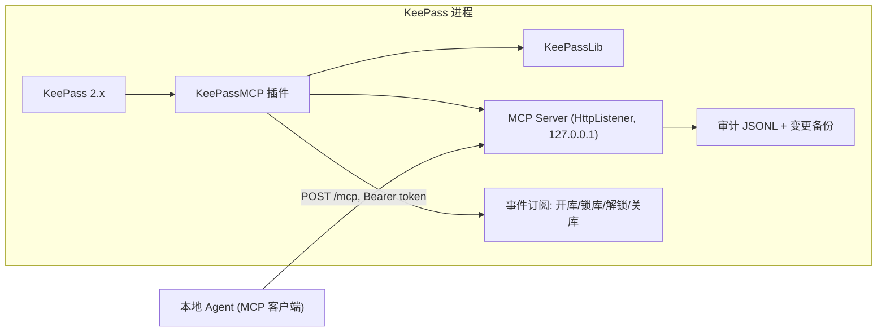

# KeePassMCP — 实施交接文档（Implementation Handoff）

> 面向：**负责写代码的会话**（无本对话上下文，本文档自包含，读此即可开工）
> 作者：设计会话（MainAgent），2026-10-01
> 配套文档：`docs/DESIGN.md`（设计背景与决策）、`README.md`（项目主页）
> 约定：本文档中的〔决策〕= 已定设计决策，必须遵守；〔待验证〕= 需在 P0 验证后定夺；〔建议〕= 推荐做法可调整

---

## 0. 任务一句话

开发一个 **KeePass 2.x 原生插件**，在本机（localhost）暴露一个 **MCP 服务**（Streamable HTTP 传输），使本地 AI Agent（标准 MCP 客户端）能**读取和修改数据库中除掩码字段外的所有字段**——重命名、重新分类（移动分组）、编辑 URL/备注/自定义字段、分组与标签管理、搜索、审计。**密码等受保护字段对 Agent 不可见、不可操作。**

**绝不实现**：除审批通过的 `read_secret` 单次返回外，返回任何受保护字段明文；修改主密钥；导出数据库；任何绕过掩码的路径。

**密钥边界（2026-10-01 访谈定稿，ADR-0001/0002）**：创建新条目时可写入保护字段值（`create_entry` 的 `fields` 或 `generate_password`，免审批）；读取已有保护字段明文（`read_secret`）与修改已有保护字段需**密钥访问审批**（白名单免审批 + KeePass UI 弹窗，超时拒绝，§6.6）；任何读出口/资源/审计/备份永不含保护字段明文。

---

## 1. 技术栈与硬约束

| 项 | 约束 | 说明 |
|----|------|------|
| 宿主 | KeePass 2.x（本机验证目标 2.60.0 便携版：`C:\Programs\KeePass\2.60.0\windows\amd64`；代码保持 2.5x+ 兼容） | 插件 API：`KeePass.Plugins.Plugin` 基类；引用 KeePass.exe（2.60 起 KeePassLib 并入 exe） |
| 运行时 | **.NET Framework 4.8**（KeePass 2.x 当前目标） | 非现代 .NET |
| UI | WinForms（复用 KeePass 主窗口） | 插件不新建主窗体 |
| 数据访问 | **引用 KeePass.exe（2.60 起 KeePassLib 合并进 KeePass.exe，无独立 KeePassLib.dll，P0 已核实）** | PwDatabase/PwGroup/PwEntry/ProtectedStringDictionary |
| MCP 实现 | **手写最小协议（JSON-RPC 2.0 + HttpListener，§6.2）〔P1 已落地并集成验证 2026-10-02〕**：官方 SDK 2.2.0 在 P0-a 可加载，但其 HTTP 传输是 ASP.NET Core 生态（核心包无公开传输类型、纯 DI builder、需 Kestrel），net48 不可用 → 按既定回退手写 | 协议面小、完全可控：initialize/ping/tools/list/call、resources/list/read；无状态（不维护会话，通知回 202） |
| JSON 序列化 | **Newtonsoft.Json 13.0.3（零依赖）〔P1 实证〕** | System.Text.Json 系在 net48 无 binding redirect 时 Unsafe 版本冲突：STJ/Encodings.Web 要 6.0.0.0、System.Memory 要 4.0.4.1，GAC 无、KeePass.exe.config 不可改；STJ 6.x 亦不例外 |
| HTTP 宿主 | **HttpListener**（.NET Framework 原生）〔已落地〕 | 127.0.0.1 随机端口；注意 WWW-Authenticate 是受限响应头不能直接赋值（P1 实测） |
| 目标 | 单机插件（非跨平台优先） | Windows 为本项目目标平台 |

---

## 2. 架构



线程模型〔决策〕：
- HttpListener 请求处理在**后台线程**；**所有 KeePassLib 读写在 UI 线程执行**（`host.MainWindow` 的 `Invoke`/`BeginInvoke`，或用 `SynchronizationContext`）。KeePassLib 大量 API 非线程安全，这是本插件最关键的实现点。
- 每个 MCP 请求：后台线程接收 → 校验 token/锁定态 → marshal 到 UI 线程执行 → 结果回后台线程序列化返回。

---

## 3. 掩码规则（核心安全边界，〔决策〕）

**判定依据**：KDBX 字段的 **Protected 标志**（KeePassLib 中 `PwEntry.Strings` 为 `ProtectedStringDictionary`，每项 `ProtectedString.IsProtected`）。

强制规则（按优先级）：
1. 字段名 == `Password` → **永远掩码**（即使未标 Protect，防御性双保险）
2. 字段 `IsProtected == true` → 掩码
3. 配置的"附加敏感字段清单"（默认空，可配置如 `UserName`）→ 掩码
4. 其余字段（Title/UserName/URL/Notes/自定义非保护字段/Tags）→ 可见可操作

**掩码语义**：
- 读：掩码字段**绝不返回明文**，输出占位符 `[protected]`；同时返回 `protected_field_names` 数组告知 Agent 哪些被掩码
- 写：掩码字段**不可写**——工具 schema 不含；`update_entry_fields` 请求中若出现掩码字段名 → 整个请求拒绝，返回 `{ok:false, error:"field 'Password' is protected"}`

**统一出口**：所有读工具/资源经同一个 `MaskedEntrySerializer` 序列化，杜绝遗漏路径（§8 EntryDto）。

**审批例外（2026-10-01，ADR-0001/0002）**：
- `create_entry` 可携带保护字段值（`fields` 传值或 `generate_password` 插件内生成），免审批；生成路径明文不经 Agent 上下文
- `read_secret`：读取保护字段明文，白名单条目免审批、非白名单走弹窗审批；返回明文仅此一次，审计逐字段记录
- `update_entry_fields`：请求含保护字段名时，未审批 → 整体拒绝 `{ok:false, error:{code:"approval_required"}}`；审批通过 → 允许
- 任何读出口/审计/备份不得包含明文（不变量）

---

## 4. MCP 工具规格（Tools）

所有工具返回信封：`{ok: bool, data?: ..., error?: {code, message}}`；MCP 层 `content` 为 JSON 文本（`type:"text"`）。

写工具统一带 `dry_run` 参数〔决策〕：`dry_run=true` 只计算并返回变更预览，**不落库、不写备份、不写审计**；预览与执行共用同一变更计算函数（所见即所得）。

### 4.1 只读工具

**`list_databases`**
```
输入: {}
输出: data: [{id: string, name: string, path: string, locked: bool, group_count: int, entry_count: int}]
```

**`list_groups`**
```
输入: {database_id: string, parent_uuid?: string}   // 缺省返回全树
输出: data: [{uuid, name, parent_uuid, child_groups: [...递归], entry_count}]
```

**`list_entries`**
```
输入: {database_id: string, group_uuid?: string, limit?: int}
输出: data: [{uuid, title, username, group_path: string, tags: string[], protected_field_names: string[]}]
```

**`get_entry`**
```
输入: {database_id: string, entry_uuid: string}
输出: data: EntryDto（§8；掩码字段值恒为 "[protected]"）
```

**`read_secret`**（密钥访问，需审批）
```
输入: {database_id: string, entry_uuid: string, fields?: string[]}   // fields 缺省=全部保护字段
审批: 白名单条目免审批；非白名单 → KeePass UI 弹窗，60s 超时拒绝（§6.6）
输出: data: {fields: {field_name: 明文}}   // 明文仅此一次返回，审计逐字段记录
拒绝: {ok:false, error:{code:"approval_denied" | "approval_timeout"}}
```

**`search_entries`**
```
输入: {database_id: string, query: string, scope?: "title"|"url"|"notes"|"all"(默认 all)}
输出: data: 同 list_entries 项
```

**`get_audit_log`**
```
输入: {limit?: int(默认50), since?: RFC3339}
输出: data: [AuditEntry（§8）]
```

### 4.2 写工具（均含 `dry_run?: bool`，默认 false）

**`rename_entry`**
```
输入: {database_id, entry_uuid, new_title, dry_run?}
```

**`update_entry_fields`**
```
输入: {database_id, entry_uuid, fields: {field_name: string_value}, dry_run?}
约束: 出现掩码字段名 → 需密钥访问审批（白名单/弹窗，§6.6），未审批则整体拒绝 approval_required；空 fields → 拒绝
```

**`move_entry`**（重新分类）
```
输入: {database_id, entry_uuid, target_group_uuid, dry_run?}
```

**`create_entry`**
```
输入: {database_id, group_uuid, title, fields?: {字段: 值}, generate_password?: {length: int, charset?: string}, dry_run?}
约束: fields 可含保护字段（Agent 传值，免审批，ADR-0001）；generate_password 由插件用 KeePass PasswordGenerator 生成并直接落库（明文不经 Agent 上下文，主推路径）；dry-run 预览中保护字段值显示 [protected]
```

**`create_group`** / **`rename_group`**
```
输入: {database_id, parent_group_uuid?, name / new_name, dry_run?}
```

**`delete_group`**（破坏性）
```
输入: {database_id, group_uuid, confirm: bool, dry_run?}
约束: confirm 必须为 true 才执行；预览必须列出将删除的条目数
```

**`add_tag`** / **`remove_tag`**
```
输入: {database_id, entry_uuid, tag, dry_run?}
```

**`backup_database`**
```
输入: {database_id}
输出: data: {backup_id, path, entry_count, created}
（立即对整库做非保护字段快照，§8 BackupManifest）
```

**`restore_backup`**（管理员，破坏性）
```
输入: {backup_id, confirm: bool}
约束: 回滚该备份涉及条目的非保护字段为备份时值；保护字段不触碰；写审计
```

**统一 dry-run 输出形状**（所有写工具）：
```
data: {
  dry_run: bool,
  changes: [{action: "rename", target: {uuid,title}, old: "旧值", new: "新值"},
            {action: "move", target: {...}, old_group: "...", new_group: "..."},
            ...],
  summary: "将重命名 2 个条目，移动 1 个条目"
}
```
`dry_run=true` → `ok:true, data.dry_run:true` 且**不产生任何副作用**；`dry_run=false` → 执行后返回同样结构的实际变更 + `executed:true`。

---

## 5. MCP 资源规格（Resources）

| URI | 返回 |
|-----|------|
| `keepass://databases` | DatabaseDto 列表 |
| `keepass://databases/{id}/groups` | 分组树 |
| `keepass://databases/{id}/entries` | 全库条目列表 |
| `keepass://databases/{id}/entries/{uuid}` | EntryDto |
| `keepass://databases/{id}/entries/{uuid}/fields` | `{fields: [{name, protected: bool, value?: string}]}`，protected 的 value 为 `[protected]` |
| `keepass://audit` | 最近审计条目 |

资源与工具共用同一掩码序列化器与锁定校验。

---

## 6. MCP 协议实现规格

### 6.1 传输（〔决策〕Streamable HTTP）
- 端点：`POST http://127.0.0.1:<port>/mcp`
- 请求头：`Authorization: Bearer <token>`；`Accept: application/json, text/event-stream`
- 响应：单 JSON 或 SSE（`event: message, data: {jsonrpc...}`）
- 仅接受 JSON-RPC 2.0 消息；未知方法返回标准错误
- **Host 头校验**：仅接受 `localhost:<port>` / `127.0.0.1:<port>`（防 DNS 重绑定）

### 6.2 最小方法集（手写实现时）
```
initialize                        → {protocolVersion, capabilities:{tools:{},resources:{}}, serverInfo:{name:"KeePassMCP",version}}
tools/list                        → 全部工具定义（name, description, inputSchema JSON Schema）
tools/call {name, arguments}      → 工具执行（掩码/锁定校验在此层入口）
resources/list                    → 资源模板
resources/read {uri}              → 资源内容
notifications/initialized         → 忽略（握手完成信号）
ping                              → {}
```
〔建议〕所有工具入参按 §4 的 JSON Schema 校验（手写一个最小校验器或直接信任+防御式类型转换）。

### 6.3 鉴权〔决策〕
- 启动时生成 32 字节 CSPRNG token（hex），**持久化**到 `%APPDATA%\KeePassMCP\token`（ACL 仅当前用户，Windows：`File.SetAccessControl` 移除其他用户）
- 每次请求校验 `Authorization: Bearer <token>`；失败返回 HTTP 401 + JSON-RPC 错误
- 提供"重置 token"入口（插件选项页）；重置后旧 token 立即失效
- KeePass 重启后 token 不变（配置一次即可）

### 6.4 端口〔决策〕
- 默认**随机端口**（HttpListener 绑定 0 后读取实际端口）；可配置固定端口
- 实际端口与连接配置片段（MCP 客户端 json）写入 `%APPDATA%\KeePassMCP\connection.json`，并在 KeePass 选项页展示

### 6.5 锁定联动〔决策〕
- 订阅 `host.MainWindow` 的库事件（FileOpened/FileClosed/FileLocked/FileUnlocked 等；以 KeePass 实际 API 为准）
- 库处于锁定态：该库相关工具/资源返回 `{ok:false, error:{code:"database_locked"}}`
- 全部库锁定：服务仍响应 initialize/ping/list_databases（locked:true），其余拒绝

### 6.6 密钥访问审批（2026-10-01 定稿，ADR-0001/0002）〔决策〕
- 两级审批：
  1. **密钥访问白名单**：按条目 UUID 配置（插件选项页可增删），白名单内条目对 `read_secret`/保护字段更新免审批，全程审计
  2. **KeePass UI 弹窗**：非白名单条目，在 `host.MainWindow` 弹确认框（显示库名/条目标题/字段名/操作类型），**默认 60s 超时按拒绝**；拒绝与超时均不返回明文
- 弹窗必须 marshal 到 UI 线程（§2 线程模型），且请求线程阻塞等待用户决策
- 所有审批事件（允许/拒绝/超时）写审计日志；审计与备份永不包含明文
- 只读工具不触发审批（`get_entry`/资源仍输出 [protected]）

### 6.7 库内配置条目（P6 设计 v2，2026-10-02 定稿、未实施）
**动机**：消除外部 token 文件依赖；授权/监听/鉴权全部随库走（备份/迁移/多机同步天然一致），判定是纯函数可完整探针化。
**配置模型（ADR-0003 字段体系，2026-10-03 定稿；取代本段早前"标题前缀 + CustomData + 标签 + secret_whitelist"方案，0002 废止）**：
- 配置条目 = 字符串字段 `_mcp_config=1` 标记（任意标题、任意分组、多条目并存）；被标记条目整条目掩码 + 备份排除
- 监听 = `_mcp_server=1` 启用 + `_mcp_listening=127.0.0.1:6789`（`;` 多地址；端口占用自动 +1）；**全部生效配置条目 `_mcp_server=0` → 服务停止且不启动**（评审 H3 修复）
- 鉴权 = token 双字段（2026-10-03，P6-3m 双向同步）：**Password 为权威输入框**（KeePass 前端直接编辑，原生保护字段）+ `_mcp_token` 为镜像（读取 Password 非空优先、空回退 `_mcp_token`）；**双向**：快照追踪判定用户改了哪个字段——改 Password → 覆盖 `_mcp_token`，改 `_mcp_token` → 覆盖 Password，双变冲突 Password 优先，`_mcp_token` 清空 → Password 填回，Password 空 → 不动；触发 FileSavingPre（保存前随本次落盘）+ Start（重启首次见 Password 权威一致化）+ RefreshToken 兜底；快照仅内存，重启失效；并集（`;` 分隔，任一匹配放行；并集为空 → 无鉴权，仅回环）
- 作用域 = `_mcp_scope_self=1` 条目不并入全局 token/监听/default 聚合（防共享库配置漂移，评审 M5 增补）
- 权限 = 六权限（Read/ReadProtected/Write/WriteProtected/Move/List）+ 审计/快照两个全局位；判定优先级：**条目显式字段 → 生效配置条目 default 布尔最严聚合（顺序无关，任一 0 即拒）→ 硬编码默认**（评审 H5 定稿）
- 配置条目 default 字段：`_mcp_read_default=1` / `_mcp_read_protected_default=0` / `_mcp_write_default=1` / `_mcp_write_protected_default=0` / `_mcp_move_default=1` / `_mcp_list_default=1` / `_mcp_audit_default=0` / `_mcp_backup_default=0` / `_mcp_save_default=0`（审计读/整库快照/显式落盘默认拒绝——M3/M6/P6-3l）
- 普通条目权限字段：`_mcp_read` / `_mcp_read_protected` / `_mcp_write` / `_mcp_write_protected` / `_mcp_move` / `_mcp_list`（`1`=允许 `0`=显式拒绝；`_mcp_list=0` 对客户端隐身）；create/update 拒绝 `_mcp_` 前缀字段（reserved_field，防自授权）
- 无任何配置条目 → 自动创建 `MCPServerConfiguration`（默认回环 + 随机 32B token + 上表默认；端口占用自动 +1）
- restore_backup 双闸门（评审 H1/H2 修复）：backupId 白名单正则拒绝路径遍历；恢复循环逐条目 Write 判定，锁定条目标记 restore_skip
- 状态提示：配置条目设专属图标/颜色，防误删误改（P8）
- 参考先例：KPEntryTemplates（keepass.info 插件页）——单条目承载配置的生态成熟模式；其 Add Entry tab 反射注入在 KeePass 2.39 曾不兼容，故注入需实测
**保护规则（铁律延伸）**：
1. 配置条目禁止 `read_secret`（错误码 `token_entry_protected`）——防 token 明文经审批进 Agent 上下文
2. 所有读出口（get_entry/list_entries/search_entries/资源）对配置条目**整条目掩码**；`_mcp_` 前缀字段读出口一律掩码（不依赖 Protected 标志）
3. `backup_database` 与写前快照**排除**配置条目
4. `get_audit_log`/`backup_database` 分别要求 `_mcp_audit_default=1`/`_mcp_backup_default=1`（默认拒绝）
**行为**：库解锁（MainForm.FileOpened 事件）后 EnsureDefaultConfig + 重读 token/监听（RefreshToken）；**锁库即服务停止监听**；多库会话 token/监听跨库并集（scope_self 排除），default 取布尔最严；无 token 集 → 回退自动生成 token（无鉴权态须用户显式清空并集）
**交互（主路径 = MCP Server Config tab，KPEntryTemplates 式，P7 已实施）**：条目表单注入 "MCP Server Config" tab（`_mcp_config=1` 条目可见）——可视化编辑 `_mcp_*` 字段（监听/多地址、token、九 default 权限三态、scope_self），字段名由插件写入杜绝手敲拼错。
- **P7-1（提交 5d14d91）注入实测**：UI Timer(500ms) 扫描打开条目编辑表单 → `_mcp_config=1` 条目反射注入 tab（`PwEntryForm.m_tabMain` 私有 TabControl）→ 引用集合防重复 + FormClosed 移除；EntrySaved 钩子 → SaveToEntry 写回 + MarkDatabaseModified + RefreshToken（点 OK 才生效，取消不污染条目）；失败仅日志降级不影响 MCP 服务
- **P7-2（提交 057073d）配置页**：McpConfigUserControl——服务开关/监听地址（`;` 多地址）、token 明文编辑 + 重新生成（CSPRNG 32B hex 64 位，双写 Password+`_mcp_token`）、九 default 三态（允许/拒绝/未设置走聚合）、scope_self；动态复选框文字；布局 AutoSize 自适应列（DPI 缩放无溢出）、标签冒号垂直居中、按钮与开关等宽
- **已知 UI 语义**：三态"取消勾选"需点到红色（拒绝）；灰色=未设置走聚合/默认——用户可能停在灰色误以为已拒绝

**线协议补充（真实客户端实测反馈，提交 26c6cc5）**：① 响应头 `application/json; charset=utf-8`（中文乱码根因，PS5.1 无 charset 按 Latin-1 解码）；② **无会话（stateless）**——initialize 后无需 notifications/initialized 与会话头；③ `list_entries` 支持 `recursive=true` 全库平铺（每条带 `group_path`，客户端按路径聚合；`keepass://entries` 资源 URI 同为递归全量）；④ DTO 新增 `is_config_entry` 非敏感标志（配置条目整条目掩码同时可编程识别）；⑤ README「Client contract」小节 + 引荐 `tools/e2e_http_check.py` 为参考客户端。探针 242/242。
**技术确认点（实施第一步）**：`PwEntry.CustomData` API 可用性实测（P6-1 完成：读写/不可见/持久/读出口全绿，但 P6-3 后配置值改用字符串字段，CustomData 仅作参考）；EntryForm 动态注入实测（真实打开 Add Entry 验证 tab 出现）。静态探测已确认（P0Probe.EntryForm）：KeePass 2.60 `KeePass.Forms.PwEntryForm` public、`m_tabMain`(TabControl) 存在、官方事件 `EntrySaving`/`EntrySaved`、MainForm 库生命周期事件 `FileOpened/FileClosed/FileSavingPre` 可用

---

## 7. 审计与备份〔决策〕

**审计**：`%APPDATA%\KeePassMCP\audit.jsonl`，JSONL 追加写。每行：
```json
{"ts":"2026-10-01T12:00:00Z","tool":"rename_entry","args":{"entry_uuid":"...","new_title":"..."},"target":"<uuid>","result":"ok","error":null,"dry_run":false}
```
- 写工具执行（dry_run=false）记录；**dry_run=true 不写审计**（§4.2「不产生任何副作用」优先于本节第一句，2026-10-02 P2 裁决）
- `read_secret` 每次访问记录（含审批结果）；审批事件（允许/拒绝/超时）单独记录
- 只读工具不记录（避免噪音；可配置记录）

**备份**：写操作执行前，自动把涉及条目的**非保护字段快照**（不含任何保护字段明文）写入 `%APPDATA%\KeePassMCP\backups\<timestamp>_<tool>_<uuid>.json`：
```json
{"backup_id":"...","ts":"...","tool":"rename_entry","database":"<name>","entries":[{EntryDto 非保护字段}],"groups":[...]}
```
`backup_database` 对整库执行同样快照。`restore_backup` 仅恢复非保护字段。

---

## 8. 数据结构（JSON 形状）

```jsonc
// EntryDto（读出口统一）
{
  "uuid": "…", "title": "…", "username": "…", "url": "…", "notes": "…",
  "tags": ["…"],
  "group_path": "Root/Work/ProjectA",
  "custom_fields": { "key": "非保护值" },   // 仅非保护自定义字段
  "protected_field_names": ["Password"],     // 掩码字段清单
  "protected_fields": { "Password": "[protected]" },  // 占位值，绝不出现明文
  "created": "…", "modified": "…"
}

// GroupDto
{ "uuid": "…", "name": "…", "parent_uuid": "…", "entry_count": 3, "child_groups": [] }

// DatabaseDto
{ "id": "…", "name": "…", "path": "…", "locked": false, "group_count": 5, "entry_count": 42 }

// AuditEntry
{ "ts": "…", "tool": "…", "args": {}, "target": "…", "result": "ok|error", "error": null, "dry_run": false }

// BackupManifest（backup_database 输出）
{ "backup_id": "…", "path": "…", "entry_count": 42, "created": "…" }
```

---

## 9. KeePass 集成要点（给实施者的实现指引）

1. **插件骨架**：`public sealed class KeePassMCPExt : Plugin`；`Initialize(IPluginHost host)` 启动服务；`Terminate()` 停止并释放。
2. **部署门槛（2.60 实测，P0-b2）**：插件 DLL 的**文件版本信息 ProductName 必须等于 `"KeePass Plugin"`**（`AppDefs.PluginProductName`），否则 `PluginManager.LoadPlugins` 静默跳过（SDK 风格 csproj 加 `<Product>KeePass Plugin</Product>`）。`KeePass.config.xml` 的 `PluginCompatibility` 是**检查通过后的自动缓存**（`SetPluginCompatible`），非白名单，无需手工登记。
3. **依赖部署（P1 实证）**：插件有依赖 DLL 时，**整体放 Plugins\ 的子目录**（如 `Plugins\KeePassMCP\KeePassMCP.dll` + 依赖），不能平铺放 Plugins\ 根（KeePass 进程解析不到依赖 → 弹"未能加载文件或程序集"）。工程加 `<CopyLocalLockFileAssemblies>true</CopyLocalLockFileAssemblies>` 把依赖拷进输出目录后整体复制。**升级 DLL 前必须结束 KeePass 进程**（运行中的 KeePass 会锁住插件 DLL，Copy-Item 失败但不报错中止后续步骤）。
3. **获取数据库**：`host.MainWindow.ActiveDatabase`（PwDatabase）；多库场景遍历 `host.MainWindow.DocumentManager`（以实际 API 为准）。
4. **写后保存**〔决策〕：操作后设 `database.Modified = true`，**不强制自动写盘**——由 KeePass 正常保存流程（Ctrl+S / 关闭提示）落盘；`backup_database` 提供显式快照。
5. **分组/条目操作**：PwGroup.Entries / PwGroup.Groups 的 Add/Remove 维护父子关系；移动条目 = 从旧组移除 + 加入目标组（保留 PwEntry 对象）。
6. **历史语义**：rename/move/字段修改会生成条目历史（PwEntry 的 History 机制），属 KeePass 原生行为，无需特殊处理。
7. **配置 UI**〔建议〕：`Tools → Options` 加一页（KeePass 配置扩展机制），展示：服务状态、端口、token、连接配置片段（一键复制）、重置 token、密钥访问白名单、附加敏感字段清单、是否记录只读审计。
8. **异常处理**：所有工具调用包 try/catch，返回 `{ok:false, error:{code, message}}`；不向 Agent 泄露堆栈细节。
9. **卸载安全**：Terminate 时停止 listener、关闭文件句柄；不残留后台线程。
10. **发布形态（plgx，2026-10-02 记录，未实施）**：`.plgx` 是 KeePass 插件打包格式——用 KeePass 自带的 PLGX 编译器（工具 → PLGX 编译器）把主 DLL + 依赖压成单个自解压文件，加载时解压到临时缓存再加载；官方/社区插件（如 KeePassRPC）发布常用此形态。开发期用**目录形态**（`Plugins\KeePassMCP\KeePassMCP.dll` + 依赖同放子目录，KeePass 2.60 递归扫描子目录，加载内容等价）原因：① 迭代快（改→编译→拷 DLL，plgx 每次要重打包+验证）；② 逻辑探针项目直接引用同一 DLL 跑断言；③ 依赖隔离不污染 Plugins\ 根（根目录 DLL 进默认 AppDomain，多插件共存易版本冲突）。**分发给最终用户时**用 PLGX 编译器将 KeePassMCP.dll 打成单文件 `.plgx` 即可，与官方形态一致（需要时再实施）。

---

## 10. 验收标准（可测清单）

P0–P3 逐项验证状态（2026-10-02 P3 完成）：

- [x] 插件加载后 KeePass 正常启动（插件选项页见 §13 P4 待做项）
- [x] 标准 MCP 客户端按 connection.json 配置可连接并 `initialize` 成功（协议协商 2025-06-18、serverInfo{KeePassMCP,0.1.0}）
- [x] 打开测试库后 `list_databases` 返回 locked:false（真实测试库集成验证）
- [x] `list_entries` / `get_entry` 中 Password 输出 `[protected]`，全响应无任何保护字段明文（真实测试库 grep 验证）
- [x] 自定义保护字段同样掩码；UserName 默认可见（探针断言）
- [x] `update_entry_fields` 传 `{"Password": "x"}` → 拒绝（P2 语义 approval_required；**P3 改审批语义**：未审批 → approval_denied/approval_timeout，审批通过 → 更新，见 §13 P3）
- [x] `rename_entry` dry_run=true → 返回预览，库无变化、无审计副作用记录（§7 裁决：dry_run 不写审计）
- [x] `rename_entry` dry_run=false → KeePass UI 显示新标题；audit.jsonl 有记录；备份目录生成快照
- [x] `move_entry` 后条目出现在目标组，group_path 更新（ParentGroup 反射 setter）
- [x] `delete_group` 无 confirm → 拒绝
- [x] 锁定库后写工具返回 `database_locked`；解锁后恢复（探针 Close 模拟）
- [x] 无 token / 错 token → HTTP 401
- [x] 构造 Host 头为外部域名 → 拒绝
- [x] 多库打开时 database_id 路由正确（代码路径覆盖；多库真实验证见 §13 P4 待做项）
- [x] `backup_database` 产出快照；`restore_backup` 回滚非保护字段（保护字段不受影响）（**真实测试库链路验证**：URL 恢复、Password 保持）
- [x] 后台线程压力下（并发请求）KeePass 不卡死、不崩溃（**10 并发 initialize 全部成功**；写操作经 UI 线程 marshal）
- [x] `create_entry` 携带 Password → 创建成功；`get_entry` 显示 [protected]；审计记录（真实测试库）
- [x] `create_entry` generate_password → 生成值落库，全响应无明文（探针 grep 验证）
- [x] `read_secret` 白名单条目 → 返回明文一次 + 审计逐字段（真实库验证：allowed whitelist）；非白名单 → 弹窗（真实库验证：用户点"允许"→ allowed popup，明文一次）；拒绝/超时 → 不返回明文（探针 fake deny/timeout 断言）
- [x] `update_entry_fields` 含保护字段未审批 → 拒绝（approval_denied/approval_timeout）；审批通过 → 更新 + 审计（真实库白名单路径验证 + 探针 fake 审批）；**dry-run 预览不弹窗、保护字段 old/new 掩码 [protected]、note 提示（P5）**
- [x] 审计 JSONL 与备份 JSON grep 无任何保护字段明文（真实库多次 grep：it4-secret-999/post-bk-pw 均不出现）

**未自动化/待用户项**：多库同时打开路由真实验证已完成（P4）；选项页 UI 已完成（P4，菜单 工具 → KeePassMCP 配置...，功能验证待用户目视）；approval 弹窗倒计时打磨已完成（P4，效果待用户目视）；`rename_entry` 等写操作"UI 可见变化"人工确认（已逻辑+真实库验证功能正确，KeePass UI 刷新需人工看一眼）。

---

## 11. 风险与〔待验证〕项

| 风险 | 影响 | 缓解 |
|------|------|------|
| MCP C# SDK 无法在 .NET Framework 4.8 加载 | 需手写协议 | **已解决（P0-a + P1）**：SDK 2.2.0 可加载但其传输是 ASP.NET Core 生态（无公开传输类型、需 Kestrel），net48 不可用 → 已按 §6.2 手写并集成验证 |
| KeePassLib 线程安全 | 崩溃/数据损坏 | 严格 UI 线程 marshal（§2）；P1 已实现 KeePassFacade.UiInvoke（MainForm.Invoke） |
| KeePass API 版本差异（2.5x vs 2.61） | 编译/运行错误 | 本机验证目标 = 2.60.0 便携版；接口用稳定的公开 API |
| HttpListener URL ACL | 端口绑定失败（非管理员） | **已解决（P0-b1）**：127.0.0.1 随机端口非管理员实测绑定成功，无需 `netsh http add urlacl` |
| 插件被 KeePass 静默跳过 | 插件不加载 | **已解决（P0-b2）**：DLL ProductName 必须为 "KeePass Plugin"（§9.2） |
| 插件依赖程序集解析不到 | 弹"未能加载文件或程序集" | **已解决（P1）**：依赖与插件同放 Plugins\ 子目录；JSON 用 Newtonsoft（零依赖）规避 Unsafe 版本冲突（§9.2 / §1） |
| HttpListener 响应头 WWW-Authenticate | 401 分支抛 ArgumentException → 500 | **已解决（P1）**：WWW-Authenticate 是受限头不能直接赋值，401 只设 StatusCode |
| 保护字段误判 | 泄露 | 三层防御：Password 硬掩码 + IsProtected + 配置清单；验收标准含明文 grep |
| `PwGroup.AddEntry` 不更新 `PwEntry.ParentGroup`（2.60） | 条目移动/创建后组归属错误 | **已解决（P2）**：ParentGroup setter 为 internal，`SetParentGroup` 反射调用（`GetProperty("ParentGroup").GetSetMethod(true)`）+ 列表 Add/Remove 显式维护；已加逻辑断言 |
| Newtonsoft JValue 整数拆箱 `(int?)v.Value` | 传整数参数（limit 等）时 InvalidCastException → internal_error | **已解决（P2）**：`Convert.ToInt32(v.Value)` 并 try/catch（boxed Int64 不能直接强转 int?） |
| `connection.json` 未随新实例更新 | 客户端拿旧端口 | **已解决（P3）**：`Start()` 每次写 connection.json 后 `VerifyConnectionFile()` 读回比对端口，不一致自动重写并记日志；多次重启集成验证端口与实际一致（历史偶发为启动时旧进程句柄所致） |
| **P6 待定：规则（Rules）语义未定义** | 库内规则承载无法定型 | 两种候选：条目级（`KeePassMCP-Block-<tool>` 标签，禁止对特定条目调特定工具）或库级（CustomData.Rules 工具白名单/黑名单）；实施 P6 前与用户确认 |
| **P6 待验证：`PwEntry.CustomData` API** | 配置值无法落库内 | 实施第一步实测（KeePass 2.60 KeePassLib 的 PwEntry.CustomData 字典读写）；失败则回退字符串字段（保护标志）+ 只读掩码 |
| **P7 待验证：EntryForm 动态注入** | Add Entry tab 无法出现 | 静态探测已通过（P0Probe.EntryForm：PwEntryForm public + m_tabMain TabControl + 官方 EntrySaving/EntrySaved 事件）；真实打开 Add Entry 动态验证（需用户配合点一次） |

---

## 12. 参考材料（项目内）

- `docs/DESIGN.md` — 设计背景、决策记录、工具/资源设计演进
- `README.md` — 项目定位与状态
- （外部，可选）`C:\Users\jinnn\Documents\Technology-Lectotype\keepass-镜像仓库调研笔记.md` — KeePass 架构、KeePassLib 模块地图、插件/ECAS 机制（DeepWiki 补充），理解代码库时有用

---

## 13. 实施顺序建议

1. **P0 验证** ~~（半天内）~~ **已完成 2026-10-01**：MCP SDK 2.2.0 net48 加载 ✓；HttpListener 127.0.0.1 随机端口非管理员绑定 ✓；插件骨架在便携版 2.60.0 加载触发 Initialize ✓；`ProtectedString.IsProtected` 掩码判定 ✓。工程：`src/KeePassMCP`（插件）+ `src/P0Probe.*`（验证探针，保留可复跑）
2. **P1 只读** ~~进行中~~ **已完成 2026-10-02**：手写 MCP 服务（initialize/ping/tools/list/call、resources/list/read）+ token 鉴权（32B CSPRNG 持久化 %APPDATA%\KeePassMCP\token，恒定时间比较）+ Host 白名单 + 锁定态（请求时 IsOpen 判定）+ list_databases/list_groups/list_entries/get_entry/search_entries + 资源 URI + 掩码序列化器。逻辑探针 42/42（P1Probe.Tools）；KeePass 集成验证全绿（401/403/405/-32601/-32700/initialize 协议协商/tools 5 个/list_databases 信封）。**待用户验证**：真实开库后 list_databases 返回库与条目（探针已用真实 PwDatabase 覆盖，UI 联动未自动化）
3. **P2 写操作** ~~进行中~~ **已完成 2026-10-02**：dry-run 框架（预览与执行共用变更计算，dry-run 零副作用：不落库/不备份/不审计）+ 写工具（rename_entry、update_entry_fields〔掩码字段→approval_required 整体拒绝，P3 接审批〕、move_entry、create_entry〔fields 含受保护字段免审批 + generate_password 插件内生成，明文不经 Agent 上下文〕、create_group、rename_group、delete_group〔confirm 硬约束 + 预览条目数〕、add_tag、remove_tag、backup_database、get_audit_log）+ 审计 JSONL（写执行记录，args 为安全参数）+ 写前备份快照 + 全局"写需确认"开关（config.json `confirm_writes`）。工具 16 个注册并集成验证；逻辑探针 99/99（42 只读 + 57 写）。发现并修复：AddEntry 不更新 ParentGroup（反射 internal setter）、JValue Int64 拆箱 InvalidCast。**待用户验证**：真实开库后写工具（rename/create 等）在 KeePass UI 可见变化
4. **P3 密钥访问与打磨** ~~进行中~~ **已完成 2026-10-02**：`IApproval` 审批框架（`UiApprovalProvider` KeePass 主窗口弹窗 60s 超时自动拒绝 + `ApprovalForm` 显示库名/条目标题/字段名/操作类型；探针注入 `FakeApproval` 允许/拒绝/超时）+ 密钥访问白名单（config.json `secret_whitelist`，按条目 UUID，命中免审批全程审计）+ `read_secret`（白名单免审批返回明文一次；非白名单弹窗；拒绝码 approval_denied/approval_timeout；审计逐字段只记字段名 + 审批事件单独记录）+ `update_entry_fields` 保护字段审批接入（替换 P2 approval_required 拒绝）+ `restore_backup`（confirm 硬约束、两阶段先预览后应用、仅恢复非保护字段、保护字段不触碰、写审计）+ connection.json 启动写后验证重写 + 并发健壮性。逻辑探针 137/137（42 只读 + 57 写 + 38 P3 密钥）。KeePass 真实测试库集成验证：create_entry 真实写库、read_secret 白名单明文一次、**弹窗审批用户点"允许"→ allowed popup**、update 保护字段白名单审批、backup→update→restore 链路（URL 恢复/Password 不触碰）、审计/备份多次 grep 无明文、10 并发 initialize 全过、18 工具注册。**P3 期间发现**：`PwDatabase.Save(IStatusLogger)`（New 后 Save(null) 落盘）；KeePass 命令行开库用位置参数 `KeePass.exe "path" -pw:pass`（`--open:` 在单实例下不可靠）；approval 弹窗在真实桌面弹出（computer_use 隔离会话不可见，需用户本人点）。测试痕迹已清理（临时库/审计/备份删除、config 复位）。**P4 待做**：插件选项页（白名单/敏感字段/开关可视化配置）、多库同时打开路由真实验证、approval 弹窗打磨（倒计时显示/拒绝原因）、`dry_run` 弹窗审批提示优化
5. **P4 配置 UI 与打磨** ~~进行中~~ **已完成 2026-10-02**：`UI/ConfigForm.cs` 配置窗口（菜单 **工具 → KeePassMCP 配置...**，`Plugin.GetMenuItem(PluginMenuType.Main)` 接入；白名单 ListBox 添加/删除 + UUID 格式校验〔32 hex，可含连字符〕、附加敏感字段同、`confirm_writes` CheckBox；保存写回 config.json〔保留现有值合并〕）；`McpServerHost.Facade` 暴露供窗口 owner；`ApprovalForm` 倒计时打磨（每秒刷新剩余秒数 Label，最后 10 秒红字加粗提示，超时自动拒绝不变）。逻辑探针 137/137 回归全绿（P4 改动不影响既有断言）。**多库路由真实集成验证**：双测试库（探针 `--create-db` 建 kp-ma/kp-mb，KeePass 位置参数 + `-pw:` 打开——注意 `-pw:` 只解锁首个库，第二个库需单实例转发 `Start-Process KeePass.exe <path> -pw:<pw>` 补开）→ `list_databases` 返回 2 库且 entry_count 各自正确；两库各 create_entry 成功；**同一 UUID 跨库查询 → entry_not_found（路由隔离正确）**；各自 get_entry 正常。测试痕迹已清理（临时库/审计/备份删除）。**P5 待做**：真实库锁定态人工确认、`dry_run` 弹窗审批提示优化、approval 弹窗自动化端到端（若未来有 GUI 自动化环境）
6. **P5 收尾打磨** ~~进行中~~ **已完成 2026-10-02**：**`update_entry_fields` dry-run 审批语义修复**（P2/P3 遗留 bug：dry-run 含保护字段也弹窗、且预览 changes 泄露保护字段 old/new 明文）→ dry-run 不再触发审批弹窗（零副作用、不打扰用户）；预览中保护字段 old/new 一律掩码 `[protected]`；响应加 `note` 提示"执行时将弹窗审批（白名单条目免审批）"。逻辑探针新增 6 断言 → **143/143 全绿**；真实测试库集成验证：dry-run 54ms 立即返回（不弹窗）、预览掩码、note 存在；执行路径（白名单）更新成功；审计无 dry-preview-pw/p5-exec-pw 明文、approval allowed whitelist 记录。测试痕迹已清理。**剩余人工确认项**：KeePass 真实锁定态后请求拒绝（探针已逻辑覆盖）、写操作 UI 可见变化目视、配置窗口/弹窗倒计时目视（P4/P5 UI 改动）
7. **P6 库内配置数据层（数据层已实施 2026-10-03，探针 198/198 + 真实库验证通过）**：设计定稿见 §6.7 v2——配置条目 `KeePassMCP.Server`（一个条目=一个服务器，多服务器标题后缀）+ **CustomData 承载 Token/Rules**（KDBX 4 官方机制，不污染字段；**补充字段回退**：CustomData 无法用 KeePass 原生 UI 手动添加，故 GetCustomToken 回退字符串字段 Token〔须 Protect=True，KeePass UI 可添加〕）+ 白名单标签 `KeePassMCP-Whitelist` / 黑名单标签 `KeePassMCP-Blacklist`（blacklisted 硬拒绝优先于白名单）+ 三条保护规则（token_entry_protected / 读出口整条目掩码 [*] / 备份排除）+ create_entry 保留标题 reserved_title + 锁库即服务停（FileOpened/FileClosed/FileSaved 驱动）。真实库验证：用户建 KeePassMCP.Server + 字段 Token（Protect）→ FileSaved 刷新 → connection.json 更新为库内值 → 新 token 200 / 旧 token 401。剩余：多库并集集成回归、Rules 语义待定、config.json secret_whitelist 迁移决策
8. **P7 MCP Server Config tab 内置交互** ~~待实施~~ **已完成 2026-10-03**：P7-1 注入实测（提交 5d14d91，UI Timer 扫描 + `PwEntryForm.m_tabMain` 反射注入 + EntrySaved 钩子）→ P7-2 可视化配置页（提交 057073d，McpConfigUserControl：监听/token/九 default 三态/scope_self，AutoSize 自适应布局）。真实库验证：配置页改字段点 OK → 新 token 落盘 connection.json 200、注入日志确认；探针 234/234。详见 §6.7 交互段
9. **P8 收尾** ~~待实施~~ **已完成 2026-10-03**：配置条目专属样式——`ApplyConfigStyle`（IconId=NetworkServer + CustomData `_color`=#96FFB4 浅绿；**KeePass 条目颜色是 UI 层 CustomData 特性，PwEntry 无 CustomColor 属性**，已实测）+ FileSavingPre 钩子 `ApplyConfigStylesToAll` 保存时全量应用（幂等；用户评审删掉配置页"应用样式"按钮，改为全自动）；EnsureDefaultConfig 自动创建即应用。提交 31dea85/b0eee31。探针 238/238。剩余：README 安装/配置/Agent 连接说明抽查补齐；复盘
