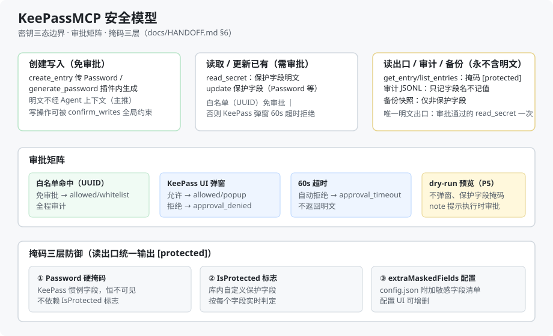

# KeePassMCP 项目小结（Final Summary）

> 生成 2026-10-02 · 状态：**P0–P5 全部完成并提交**（HEAD `ed56243`）
> 详细规格见 [HANDOFF.md](HANDOFF.md)（实施自包含规格）/ [DESIGN.md](DESIGN.md)（设计演进）/ [CONTEXT.md](../CONTEXT.md)（词表）与 [docs/adr/](adr/)（决策记录）。

## 1. 项目定位

KeePass 2.x 原生 MCP 插件：向标准 MCP 客户端（moirai 等本地 Agent）暴露 KeePass 密码库的**读、写、密钥访问**能力，通过 HttpListener 本机回环 + Bearer token 鉴权。[来源: docs/HANDOFF.md §1]

核心安全边界（Q1 三态模型，[来源: docs/adr/0001-secret-access-model.md]）：

| 状态 | 行为 |
|---|---|
| **创建新密钥数据** | 可写入，免审批（create_entry 传值 / generate_password 插件内生成，主推） |
| **读取 / 更新已有密钥** | 需审批：白名单（条目 UUID）免审批；否则 KeePass UI 弹窗，60s 超时自动拒绝 |
| **读出口 / 审计 / 备份** | 永不含明文；唯一明文出口是审批通过的 `read_secret` 单次返回 |

## 2. 部署与配置

### 部署
- 插件 DLL：复制 `KeePassMCP.dll` + `Newtonsoft.Json.dll` 到 `Plugins\KeePassMCP\` 子目录（依赖必须同目录）[来源: docs/HANDOFF.md §9.2]
- 更新 DLL 前必须结束 KeePass 进程（DLL 被锁 → Copy-Item 静默失败）
- 本机验证目标：KeePass 2.60.0 便携版 `C:\Programs\KeePass\2.60.0\windows\amd64`
- **发布形态**：开发期用目录形态（迭代快、探针引用同一 DLL、依赖隔离）；分发时可用 KeePass 自带 PLGX 编译器打成单个 `.plgx` 文件（官方插件形态，未实施，见 HANDOFF §9.10）

### 数据目录（`%APPDATA%\KeePassMCP\`，可用 `KeePassMCP_DATA_DIR` 覆盖）
| 文件 | 用途 |
|---|---|
| `token` | 32B CSPRNG Bearer token，启动生成持久化 |
| `connection.json` | MCP 客户端连接信息（端口 + Authorization），启动写后自校验重写 |
| `config.json` | 配置：`secret_whitelist`（条目 UUID 数组）/ `extraMaskedFields`（附加敏感字段）/ `confirm_writes`（全局写确认开关）；可用菜单 **工具 → KeePassMCP 配置...** 可视化编辑 |
| `audit.jsonl` | 审计日志（写执行 / 密钥访问逐字段 / 审批事件；args 为安全参数不含明文） |
| `backups\` | 写前备份快照（仅非保护字段） |
| `keepassmcp.log` | 运行日志 |

## 3. 工具清单（18 个，tools/list）

### 只读（5）
| 工具 | 说明 |
|---|---|
| `list_databases` | 打开库列表（含 locked 状态） |
| `list_groups` | 分组树 |
| `list_entries` | 条目列表（Password 等保护字段 → `[protected]`） |
| `get_entry` | 单条目详情（掩码） |
| `search_entries` | 关键字搜索 |

### 密钥访问 / 审计（2）
| 工具 | 说明 |
|---|---|
| `read_secret` | 保护字段明文，白名单免审批 / 弹窗审批；明文仅此一次；审计逐字段 |
| `get_audit_log` | 读取审计日志 |

### 写 / 备份（11，均支持 `dry_run` 预览，零副作用）
| 工具 | 审批 / 约束 |
|---|---|
| `create_entry` | 创建新条目；Password 免审批（创建态）；`generate_password` 插件内生成 |
| `update_entry_fields` | 含保护字段 → 需审批（P3 接入）；dry-run 预览掩码 + note（P5） |
| `rename_entry` / `move_entry` | 重命名 / 移动 |
| `create_group` / `rename_group` / `delete_group` | 分组操作；delete 需 `confirm:true` |
| `add_tag` / `remove_tag` | 标签 |
| `backup_database` | 整库非保护字段快照 |
| `restore_backup` | 回滚非保护字段（保护字段不触碰）；需 `confirm:true`；错误码 `backup_not_found`/`backup_corrupt` |

错误码约定：`approval_denied` / `approval_timeout`（审批拒绝/超时）、`database_not_found` / `database_locked` / `entry_not_found` / `invalid_params` 等。[来源: docs/HANDOFF.md §4]

## 4. moirai / 标准 MCP 客户端接入

`connection.json` 自动生成，客户端按 Streamable HTTP 直连（无 SSE 参数，HttpListener 单请求应答）：

```json
{
  "url": "http://127.0.0.1:<port>/mcp",
  "mcp_client": {
    "type": "http",
    "headers": { "Authorization": "Bearer <token>" }
  }
}
```

- 协议：JSON-RPC 2.0 + MCP initialize（2025-06-18 协商）[来源: docs/HANDOFF.md §6.2 手写最小协议（MCP SDK 2.2.0 在 net48 无公开传输类型，P0 已证）]
- 锁定态联动：KeePass 锁定库后请求返回 `database_locked`
- 并发：HttpListener 多请求 + KeePassLib 经 UI 线程 marshal（10 并发 initialize 实测全过）

## 5. 安全模型（图示）



审批矩阵：[来源: docs/HANDOFF.md §6.6 / docs/adr/0002-approval-whitelist-and-popup.md]
- 白名单（config `secret_whitelist` 按条目 UUID，配置 UI 可增删）→ 免审批，全程审计
- KeePass UI 弹窗（显示库名/条目标题/字段名/操作类型，倒计时最后 10s 红字）→ 允许/拒绝/60s 超时
- dry-run 预览 → 不弹窗、保护字段掩码（P5 修复）

## 6. 验证矩阵

| 层 | 结果 |
|---|---|
| 逻辑探针 `P1Probe.Tools` | **143/143 全绿**（42 只读 + 57 写 + 38 密钥 + 6 dry-run），退出码 0 |
| 真实测试库集成 | create_entry 真实写库、read_secret 白名单/弹窗（用户点允许）明文一次、update 保护字段审批、backup→update→restore 链路（URL 恢复 / Password 不触碰）、dry-run 54ms 不弹窗 |
| 安全断言 | 审计/备份多次 grep 无明文（多个测试密码均不出现）；跨库 UUID 查询 entry_not_found（多库路由隔离） |
| 并发 | 10×initialize 全 ok |

剩余人工确认项（需你在 KeePass UI 操作）：锁定库后写工具返回 `database_locked`、写操作 UI 可见变化、配置窗口/弹窗倒计时目视。[来源: docs/DESIGN.md §12]

## 7. 项目结构

```
keepass-mcp/
├── CONTEXT.md / README.md
├── docs/
│   ├── DESIGN.md / HANDOFF.md / diagram-security-model.svg
│   └── adr/ 0001-secret-access-model.md · 0002-approval-whitelist-and-popup.md
└── src/
    ├── KeePassMCP/            # 插件（Core 门面/审批/配置/掩码 + MCP 服务 + UI 配置窗口）
    ├── P1Probe.Tools/         # 逻辑探针（143 断言 + --create-db 辅助建库）
    └── P0Probe.{McpSdk,HttpListener,KeePassLib}/   # P0 验证探针（保留可复跑）
```

git 历史：`3e33f22`(P0) → `169dd37`(P1) → `5865f9b`(P2) → `f6acacd`(P3) → `39764e7`(P4) → `ed56243`(P5)。
